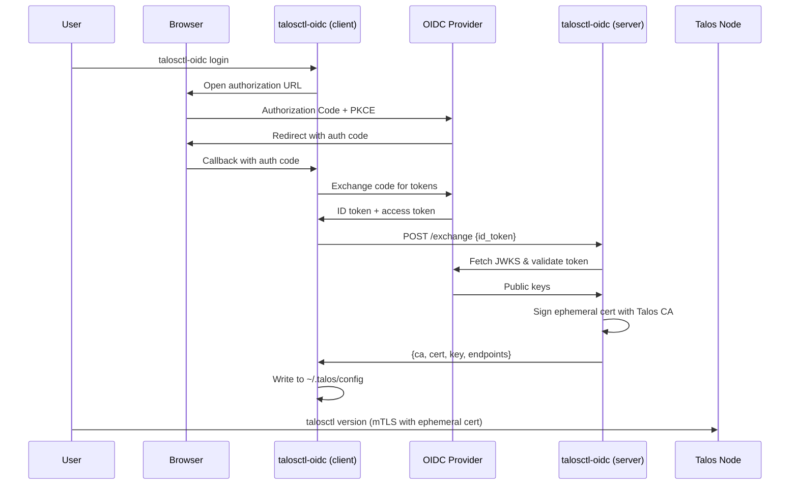

# talosctl-oidc

OIDC certificate exchange server and client for [Talos Linux](https://www.talos.dev/). Enables OIDC-based access control for `talosctl` by issuing ephemeral short-lived client certificates signed by the Talos CA.


## How It Works

Talos Linux uses **mTLS (mutual TLS) with client certificates** for API authentication. There is no native OIDC support in the Talos API. This tool bridges the gap through a **certificate exchange server** model:

1. A **server** (`talosctl-oidc serve`) holds the Talos CA private key and runs alongside the cluster (as a Talos extension or standalone)
2. A **user** runs `talosctl-oidc login`, which opens a browser for OIDC authentication (Authorization Code + PKCE)
3. The client sends the resulting ID token to the server
4. The server validates the token (signature, issuer, audience, expiry) and signs an **ephemeral short-lived client certificate** (e.g., 1 hour)
5. The client writes the certificate to `~/.talos/config`
6. When the certificate expires, the user must re-authenticate via OIDC



## Prerequisites

- **Go 1.25+** (to build from source)
- **A running Talos cluster** with API access
- **The Talos API CA certificate and private key** (from `controlplane.yaml`, the first `ca:` block under `machine.ca`)
- **An OIDC provider** with a configured client application (any OIDC-compliant provider works)

## Installation

### From source

```bash
git clone https://github.com/qjoly/talosctl-oidc.git
cd talosctl-oidc
go build -o talosctl-oidc .
```

Move the binary to a directory in your `$PATH`:

```bash
sudo mv talosctl-oidc /usr/local/bin/
```

### As a Talos system extension

Build the extension image, then use the Talos `imager` to create a custom installer that includes it:

```bash
# Build and push the extension OCI image
docker build -t ghcr.io/qjoly/talosctl-oidc:v0.1.0 --target extension .
docker push ghcr.io/qjoly/talosctl-oidc:0.1.0

# Build a custom Talos installer with the extension baked in
TALOS_VERSION=v1.12.4
EXTENSION_REF=$(crane digest ghcr.io/qjoly/talosctl-oidc:0.1.0)

docker run --rm -t -v $PWD/_out:/out \
  ghcr.io/siderolabs/imager:${TALOS_VERSION} installer \
  --system-extension-image ghcr.io/qjoly/talosctl-oidc:0.1.0@${EXTENSION_REF}

# Push the custom installer to your registry
crane push _out/installer-amd64.tar ghcr.io/qjoly/talos-oidc-installer:${TALOS_VERSION}

# Install or upgrade with it
talosctl upgrade --image ghcr.io/qjoly/talos-oidc-installer:${TALOS_VERSION}
```

See [Deploying as a Talos Extension](#deploying-as-a-talos-extension) for detailed configuration.

## Setup

### 1. Configure your OIDC provider

Create a client application in your OIDC provider with the following settings:

| Setting | Value |
|---------|-------|
| Client type | Public |
| Grant type | Authorization Code |
| Redirect URI | `http://127.0.0.1:8900/callback` |
| Scopes | `openid`, `profile`, `email` |
| PKCE | Enabled (S256) |

#### Authentik

1. Go to **Admin** > **Applications** > **Providers** > **Create**
2. Select **OAuth2/OpenID Provider**
3. Set **Client type** to **Public**
4. Set **Redirect URIs** to `http://127.0.0.1:8900/callback`
5. Under **Advanced**, ensure **Subject mode** is set appropriately
6. Create an **Application** linked to this provider

#### Keycloak

1. Go to your Keycloak admin console > **Clients** > **Create client**
2. Set **Client authentication** to **Off** (public client)
3. Enable **Standard flow** (Authorization Code)
4. Set **Valid redirect URIs** to `http://127.0.0.1:8900/callback`
5. Under **Advanced** > **Proof Key for Code Exchange**, set to `S256`

#### Dex

```yaml
staticClients:
  - id: talosctl
    name: "Talosctl OIDC"
    redirectURIs:
      - "http://127.0.0.1:8900/callback"
    public: true
```

### 2. Extract the Talos API CA

The server needs the Talos API CA certificate and private key to sign client certificates. These are found in your cluster's `controlplane.yaml` (the first `ca:` block under `machine:`).

```bash
# From controlplane.yaml, extract the first ca block
yq '.machine.ca.crt' controlplane.yaml | base64 -d > talos-ca.crt
yq '.machine.ca.key' controlplane.yaml | base64 -d > talos-ca.key
```

> **Important**: This is the **machine/API CA**, not the OS-level CA from `secrets.yaml`. The API CA is the one that signs client certificates used by `talosctl`.

### 3. Start the server

The `serve` command is configured entirely via environment variables (no CLI flags):

```bash
export TALOSCTL_OIDC_CA_CERT=talos-ca.crt
export TALOSCTL_OIDC_CA_KEY=talos-ca.key
export TALOSCTL_OIDC_ISSUER_URL=https://idp.example.com/application/o/talos-oidc/
export TALOSCTL_OIDC_CLIENT_ID=<your-client-id>
export TALOSCTL_OIDC_ENDPOINTS=10.0.0.1,10.0.0.2
export TALOSCTL_OIDC_LISTEN=:8443
export TALOSCTL_OIDC_CERT_TTL=1h
export TALOSCTL_OIDC_ROLES=os:admin

talosctl-oidc serve
```

By default, the server generates a **self-signed TLS certificate** at startup and logs the CA PEM. Save the CA PEM to a file and pass it to `login --server-ca` so the client trusts the server.

To use your own TLS certificates:

```bash
export TALOSCTL_OIDC_TLS_CERT=/path/to/server.crt
export TALOSCTL_OIDC_TLS_KEY=/path/to/server.key
talosctl-oidc serve
```

To run without TLS (not recommended for production):

```bash
export TALOSCTL_OIDC_INSECURE=true
talosctl-oidc serve
```

### 4. Login

```bash
# With self-signed TLS (default server mode), save the CA PEM from server logs:
talosctl-oidc login \
  --provider https://idp.example.com/application/o/talos-oidc/ \
  --client-id <your-client-id> \
  --server https://localhost:8443 \
  --server-ca server-ca.pem \
  --context-name oidc \
  --callback-port 8900

# With insecure server:
talosctl-oidc login \
  --provider https://idp.example.com/application/o/talos-oidc/ \
  --client-id <your-client-id> \
  --server http://localhost:8443 \
  --insecure \
  --context-name oidc \
  --callback-port 8900
```

This will:

1. Open your browser to the OIDC provider login page
2. Wait for you to authenticate
3. Exchange the ID token with the cert server for an ephemeral certificate (over TLS)
4. Write the certificate to `~/.talos/config` under the `oidc` context

### 5. Use talosctl

After login, `talosctl` works normally:

```bash
talosctl --context oidc version
talosctl --context oidc get members
talosctl --context oidc dashboard
```

## Commands

### `serve`

Start the certificate exchange server. All configuration is via environment variables.

```bash
talosctl-oidc serve
```

#### Environment Variables

| Variable | Required | Default | Description |
|----------|----------|---------|-------------|
| `TALOSCTL_OIDC_CA_CERT` | Yes | | Path to Talos CA certificate |
| `TALOSCTL_OIDC_CA_KEY` | Yes | | Path to Talos CA private key |
| `TALOSCTL_OIDC_ISSUER_URL` | Yes | | OIDC issuer URL for token validation |
| `TALOSCTL_OIDC_CLIENT_ID` | Yes | | Expected OIDC client ID / audience |
| `TALOSCTL_OIDC_ENDPOINTS` | Yes | | Talos node endpoints (comma-separated) |
| `TALOSCTL_OIDC_CLIENT_SECRET` | No | | OIDC client secret (for HS256-signed tokens) |
| `TALOSCTL_OIDC_LISTEN` | No | `:8443` | Address to listen on |
| `TALOSCTL_OIDC_CERT_TTL` | No | `1h` | Lifetime of issued client certificates |
| `TALOSCTL_OIDC_ROLES` | No | `os:admin` | Talos roles (comma-separated) |
| `TALOSCTL_OIDC_TLS_CERT` | No | | Path to TLS certificate (HTTPS with provided cert) |
| `TALOSCTL_OIDC_TLS_KEY` | No | | Path to TLS private key (must be set with TLS_CERT) |
| `TALOSCTL_OIDC_INSECURE` | No | `false` | Set to `true` to serve plain HTTP |
| `TALOSCTL_OIDC_DATA_DIR` | No | | Directory to persist self-signed TLS certs across restarts |

#### TLS Modes

| Mode | Configuration | Description |
|------|--------------|-------------|
| **Self-signed** (default) | No TLS env vars | Generates a self-signed cert at startup, logs the CA PEM |
| **Self-signed + persisted** | `DATA_DIR=/data` | Same as above, but cert is saved to disk and reused on restart |
| **Provided cert** | `TLS_CERT` + `TLS_KEY` | HTTPS with your own certificate |
| **Insecure** | `INSECURE=true` | Plain HTTP (not recommended for production) |

When `TALOSCTL_OIDC_DATA_DIR` is set, the self-signed CA and server certificate are
saved to `<DATA_DIR>/ca.crt`, `ca.key`, `server.crt`, and `server.key`. On subsequent
restarts, the same certificates are reloaded so the CA PEM stays stable and clients
don't need to update their `--server-ca` file.

#### API Endpoints

| Endpoint | Method | Description |
|----------|--------|-------------|
| `/exchange` | POST | Exchange an OIDC ID token for an ephemeral certificate |
| `/healthz` | GET | Health check (returns `200 OK`) |
| `/ca` | GET | Returns the self-signed CA PEM (only in self-signed mode) |

**Exchange request:**

```json
{"id_token": "eyJ..."}
```

**Exchange response:**

```json
{
  "ca": "-----BEGIN CERTIFICATE-----\n...",
  "cert": "-----BEGIN CERTIFICATE-----\n...",
  "key": "-----BEGIN ED25519 PRIVATE KEY-----\n...",
  "endpoints": ["10.0.0.1"],
  "ttl_seconds": 3600
}
```

### `login`

Authenticate via OIDC and obtain ephemeral Talos credentials.

```bash
talosctl-oidc login [flags]
```

| Flag | Required | Default | Description |
|------|----------|---------|-------------|
| `--provider` | Yes | | OIDC issuer URL |
| `--client-id` | Yes | | OIDC client ID |
| `--server` | Yes | | Cert exchange server URL (e.g. `https://localhost:8443`) |
| `--client-secret` | No | | OIDC client secret (for confidential clients) |
| `--scopes` | No | `openid,profile,email` | OIDC scopes |
| `--callback-port` | No | `8900` | Local callback server port |
| `--context-name` | No | `oidc` | Name for the talosconfig context |
| `--talosconfig` | No | `~/.talos/config` | Path to talosconfig file |
| `--server-ca` | No | | Path to PEM CA certificate to trust for the server (for self-signed TLS) |
| `--insecure` | No | `false` | Allow plain HTTP connection to the server |

### `logout`

Remove OIDC credentials and clear cached tokens.

```bash
talosctl-oidc logout [flags]
```

| Flag | Required | Default | Description |
|------|----------|---------|-------------|
| `--context-name` | No | `oidc` | Name of the talosconfig context to remove |
| `--talosconfig` | No | `~/.talos/config` | Path to talosconfig file |

This removes:

- The OIDC token from the system keychain
- The context (including embedded certificates) from the talosconfig file

### `status`

Display current authentication status.

```bash
talosctl-oidc status [flags]
```

| Flag | Required | Default | Description |
|------|----------|---------|-------------|
| `--context-name` | No | `oidc` | Name of the talosconfig context to check |
| `--talosconfig` | No | `~/.talos/config` | Path to talosconfig file |

## Deploying as a Talos Extension

Talos system extensions must be **baked into the installer image** — you cannot install them at runtime. This requires building a custom installer image using the Talos `imager`.

### 1. Build and push the extension image

```bash
docker build -t ghcr.io/qjoly/talosctl-oidc:v0.1.0 --target extension .
docker push ghcr.io/qjoly/talosctl-oidc:v0.1.0
```

### 2. Build a custom Talos installer with the extension

Use the Talos `imager` container to produce an installer image that includes the extension. You need [`crane`](https://github.com/google/go-containerregistry/tree/main/cmd/crane) to push the result.

```bash
# Determine the digest of your extension image
EXTENSION_REF=$(crane digest ghcr.io/qjoly/talosctl-oidc:v0.1.0)

# Build the installer (adjust the Talos version to match your cluster)
TALOS_VERSION=v1.9.5

docker run --rm -t -v $PWD/_out:/out \
  ghcr.io/siderolabs/imager:${TALOS_VERSION} installer \
  --system-extension-image ghcr.io/qjoly/talosctl-oidc:v0.1.0@${EXTENSION_REF}
```

This produces `_out/metal-amd64-installer.tar`.

Push it to your container registry:

```bash
crane push _out/metal-amd64-installer.tar ghcr.io/qjoly/talos-oidc-installer:${TALOS_VERSION}
```

### 3. Install or upgrade with the custom installer

**For a new installation**, reference the custom installer in your machine config:

```yaml
machine:
  install:
    image: ghcr.io/qjoly/talos-oidc-installer:v1.9.5
```

**For an existing cluster**, upgrade nodes to the new installer:

```bash
talosctl upgrade --image ghcr.io/qjoly/talos-oidc-installer:v1.9.5
```

> You can also build an ISO for bare-metal boot by replacing `installer` with `iso` in the imager command.

### 4. Configure the extension service

The extension reads its configuration from an `ExtensionServiceConfig` document in the Talos machine config. The CA certificate and key are provided as config files, and all runtime settings are passed via environment variables.

Add this to your machine config (or apply it via `talosctl apply-config`):

```yaml
apiVersion: v1alpha1
kind: ExtensionServiceConfig
name: talosctl-oidc
configFiles:
  - content: |
      -----BEGIN CERTIFICATE-----
      <your Talos API CA certificate>
      -----END CERTIFICATE-----
    mountPath: /config/ca.crt
  - content: |
      -----BEGIN ED25519 PRIVATE KEY-----
      <your Talos API CA private key>
      -----END ED25519 PRIVATE KEY-----
    mountPath: /config/ca.key
environment:
  - TALOSCTL_OIDC_CA_CERT=/config/ca.crt
  - TALOSCTL_OIDC_CA_KEY=/config/ca.key
  - TALOSCTL_OIDC_ISSUER_URL=https://idp.example.com/application/o/talos-oidc/
  - TALOSCTL_OIDC_CLIENT_ID=your-client-id
  - TALOSCTL_OIDC_ENDPOINTS=10.0.0.1,10.0.0.2
  - TALOSCTL_OIDC_CERT_TTL=1h
  - TALOSCTL_OIDC_ROLES=os:admin
  - TALOSCTL_OIDC_DATA_DIR=/data
```

The extension service config mounts `/var/lib/talosctl-oidc` on the host to `/data` inside the container (defined in `talosctl-oidc.yaml`). This persists the self-signed TLS certificate across restarts so the CA PEM stays stable.

The server will generate a self-signed TLS certificate on first start and save it to `/data`. On subsequent restarts, the same certificate is reloaded. To use your own TLS certs instead, mount them as config files and set `TALOSCTL_OIDC_TLS_CERT` and `TALOSCTL_OIDC_TLS_KEY`.

See the [Environment Variables](#environment-variables) table for all available settings.

### 5. Manage the extension service

After the node boots (or upgrades) with the custom installer, the extension runs as `ext-talosctl-oidc`:

```bash
# Check service status
talosctl service ext-talosctl-oidc

# View logs
talosctl logs ext-talosctl-oidc

# Restart the service
talosctl service ext-talosctl-oidc restart
```

## Token Caching Behavior

OIDC tokens are cached in the **system keychain** (macOS Keychain, GNOME Keyring, KDE Wallet, or Windows Credential Manager).

| Scenario | Behavior |
|----------|----------|
| No cached token | Opens browser for full OIDC login |
| Valid cached token | Skips browser, exchanges cached token for new cert |
| Expired token with refresh token | Silently refreshes, no browser needed |
| Expired token without refresh token | Opens browser for full OIDC login |
| Refresh fails | Falls back to full OIDC login |

The login flow has a **5-minute timeout**. If the user does not complete authentication in the browser within that window, the command exits with an error.

## Multiple Clusters

Use `--context-name` to manage credentials for different Talos clusters:

```bash
# Login to production cluster
talosctl-oidc login \
  --provider https://idp.example.com/realms/talos \
  --client-id talosctl \
  --server https://prod-oidc-server:8443 \
  --server-ca prod-ca.pem \
  --context-name prod

# Login to staging cluster
talosctl-oidc login \
  --provider https://idp.example.com/realms/talos \
  --client-id talosctl \
  --server https://staging-oidc-server:8443 \
  --server-ca staging-ca.pem \
  --context-name staging

# Switch between clusters
talosctl --context prod version
talosctl --context staging version

# Check status of each
talosctl-oidc status --context-name prod
talosctl-oidc status --context-name staging
```

## Security Considerations

- **TLS by default**: The server generates a self-signed TLS certificate at startup when no TLS configuration is provided. Plain HTTP requires explicitly setting `TALOSCTL_OIDC_INSECURE=true`
- **Ephemeral certificates**: Client certificates are short-lived (default 1 hour). Users cannot extend or forge certificates without re-authenticating
- **CA key isolation**: The Talos CA private key is held only by the server, never exposed to clients
- **PKCE is mandatory**: The OIDC flow uses S256 challenge method, protecting against authorization code interception
- **OIDC tokens are stored in the system keychain**, encrypted at rest by the operating system
- **Token validation**: The server validates ID tokens against the OIDC provider's JWKS (RS256, ES256, EdDSA) or HMAC secret (HS256)
- **The callback server binds to `127.0.0.1` only**, preventing access from other machines
- **State parameter** is used for CSRF protection during the OIDC flow

## Troubleshooting

### "invalid_client" error during login

The OIDC provider is rejecting the token request. Common causes:

- The provider is configured as a **confidential client** but no `--client-secret` was provided. Either switch to a public client or pass `--client-secret`
- The **Client ID** is incorrect

### "failed to listen on port 8900"

Another process is using port 8900. Use `--callback-port` to pick a different port. Make sure the redirect URI in your OIDC provider matches (e.g. `http://127.0.0.1:9000/callback`).

### "OIDC discovery failed"

The tool could not reach the OIDC provider's `/.well-known/openid-configuration` endpoint. Verify:

- The `--provider` / `--issuer-url` is correct and reachable
- Your network/proxy allows access to the provider

### "state mismatch: possible CSRF attack"

The state parameter returned by the OIDC provider does not match what was sent. This could indicate a stale browser tab. Try the login again.

### Server: "loading CA" error

The CA certificate and key files could not be loaded. Verify:

- The files are valid PEM-encoded Ed25519 certificates/keys
- You are using the **Talos API CA** (from `machine.ca` in `controlplane.yaml`), not the OS-level CA from `secrets.yaml`
- The cert and key match (same public key)

### Keychain errors on Linux

On Linux, `go-keyring` requires a running secret service (GNOME Keyring or KDE Wallet). On headless servers:

```bash
sudo apt install gnome-keyring
eval $(gnome-keyring-daemon --start --components=secrets)
export GNOME_KEYRING_CONTROL
```
