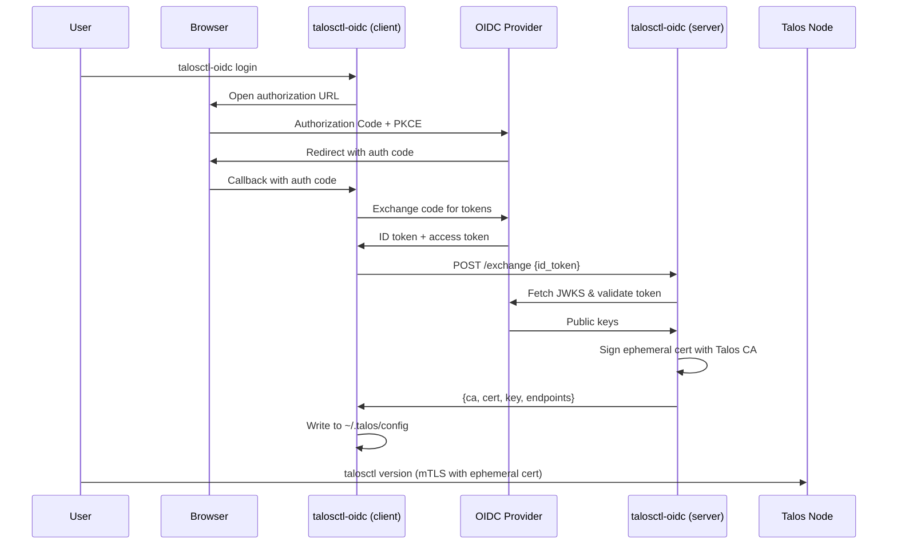

# talosctl-oidc

OIDC certificate exchange server and client for [Talos Linux](https://www.talos.dev/). Enables OIDC-based access control for `talosctl` by issuing ephemeral short-lived client certificates signed by the Talos CA.


## How It Works

Talos Linux uses **mTLS (mutual TLS) with client certificates** for API authentication. There is no native OIDC support in the Talos API. This tool bridges the gap through a **certificate exchange server** model:

1. A **server** (`talosctl-oidc serve`) holds the Talos CA private key and runs alongside the cluster (as a Talos extension or standalone)
2. A **user** runs `talosctl-oidc login`, which opens a browser for OIDC authentication (Authorization Code + PKCE)
3. The client sends the resulting ID token to the server
4. The server validates the token (signature, issuer, audience, expiry) and signs an **ephemeral short-lived client certificate** (e.g., 1 hour)
5. The client writes the certificate to `~/.talos/config` (using atomic updates to prevent corruption)
6. Before expiry, the client can proactively renew the certificate using the OIDC refresh token, either on demand or in the background via the `--watch` flag



## Demo


## Prerequisites

- **Go 1.25+** (to build from source)
- **A running Talos cluster** with API access
- **The Talos API CA certificate and private key** (from `controlplane.yaml`, the first `ca:` block under `machine.ca`)
- **An OIDC provider** with a configured client application (any OIDC-compliant provider works)

## Installation

### From source

```bash
git clone https://github.com/qjoly/talosctl-oidc.git
cd talosctl-oidc
go build -o talosctl-oidc .
```

Move the binary to a directory in your `$PATH`:

```bash
sudo mv talosctl-oidc /usr/local/bin/
```

### As a Talos system extension

Build the extension image, then use the Talos `imager` to create a custom installer that includes it:

```bash
# Build and push the extension OCI image
docker build -t ghcr.io/qjoly/talosctl-oidc-talos-ext:v0.1.0 --target extension .
docker push ghcr.io/qjoly/talosctl-oidc-talos-ext:v0.1.0

# Build a custom Talos installer with the extension baked in
TALOS_VERSION=v1.12.4
EXTENSION_REF=$(crane digest ghcr.io/qjoly/talosctl-oidc-talos-ext:v0.1.0)

docker run --rm -t -v $PWD/_out:/out \
  ghcr.io/siderolabs/imager:${TALOS_VERSION} installer \
  --system-extension-image ghcr.io/qjoly/talosctl-oidc-talos-ext:v0.1.0@${EXTENSION_REF}

# Push the custom installer to your registry
crane push _out/installer-amd64.tar ghcr.io/qjoly/talosctl-oidc-installer:${TALOS_VERSION}

# Install or upgrade with it
talosctl upgrade --image ghcr.io/qjoly/talosctl-oidc-installer:${TALOS_VERSION}
```

See [Deploying as a Talos Extension](#deploying-as-a-talos-extension) for detailed configuration.

## Setup

### 1. Configure your OIDC provider

Create a client application in your OIDC provider with the following settings:

| Setting | Value |
|---------|-------|
| Client type | Public |
| Grant type | Authorization Code |
| Redirect URI | `http://127.0.0.1:8900/callback` |
| Scopes | `openid`, `profile`, `email`, `offline_access` |
| PKCE | Enabled (S256) |

#### Authentik

1. Go to **Admin** > **Applications** > **Providers** > **Create**
2. Select **OAuth2/OpenID Provider**
3. Set **Client type** to **Public**
4. Set **Redirect URIs** to `http://127.0.0.1:8900/callback`
5. Under **Advanced**, ensure **Subject mode** is set appropriately
6. Add scopes `openid`, `profile`, `offline_access` and `email`
6. Create an **Application** linked to this provider

#### Keycloak

1. Go to your Keycloak admin console > **Clients** > **Create client**
2. Set **Client authentication** to **Off** (public client)
3. Enable **Standard flow** (Authorization Code)
4. Set **Valid redirect URIs** to `http://127.0.0.1:8900/callback`
5. Under **Advanced** > **Proof Key for Code Exchange**, set to `S256`

#### Dex

```yaml
staticClients:
  - id: talosctl
    name: "Talosctl OIDC"
    redirectURIs:
      - "http://127.0.0.1:8900/callback"
    public: true
```

### 2. Extract the Talos API CA

The server needs the Talos API CA certificate and private key to sign client certificates. These are found in your cluster's `controlplane.yaml` (the first `ca:` block under `machine:`).

```bash
# From controlplane.yaml, extract the first ca block
yq '.machine.ca.crt' controlplane.yaml | base64 -d > talos-ca.crt
yq '.machine.ca.key' controlplane.yaml | base64 -d > talos-ca.key
```

> **Important**: This is the **machine/API CA**, not the OS-level CA from `secrets.yaml`. The API CA is the one that signs client certificates used by `talosctl`.

### 3. Start the server

The `serve` command can be configured via **environment variables** or a **YAML configuration file**. Environment variables take precedence over file values when both are set.

#### Option A: Configuration File (Recommended)

Create a `config.yaml` file and specify it with the `--config` flag:

```bash
talosctl-oidc serve --config config.yaml
```

**Example `config.yaml`:**

```yaml
issuer_url: https://idp.example.com/application/o/talos-oidc/
client_id: your-client-id
endpoints:
  - 10.0.0.1
  - 10.0.0.2
ca_cert: talos-ca.crt
ca_key: talos-ca.key
listen: ":8443"
cert_ttl: "1h"
roles:
  - os:admin
```

You can also set the config file path via the `TALOSCTL_OIDC_CONFIG` environment variable:

```bash
export TALOSCTL_OIDC_CONFIG=/etc/talosctl-oidc/config.yaml
talosctl-oidc serve
```

> **Note:** See the [Configuration wiki page](https://github.com/qjoly/talosctl-oidc/wiki/Configuration) for complete documentation on config file options and precedence rules.

#### Option B: Environment Variables

Configure entirely via environment variables:

```bash
export TALOSCTL_OIDC_CA_CERT=talos-ca.crt
export TALOSCTL_OIDC_CA_KEY=talos-ca.key
export TALOSCTL_OIDC_ISSUER_URL=https://idp.example.com/application/o/talos-oidc/
export TALOSCTL_OIDC_CLIENT_ID=<your-client-id>
export TALOSCTL_OIDC_ENDPOINTS=10.0.0.1,10.0.0.2
export TALOSCTL_OIDC_LISTEN=:8443
export TALOSCTL_OIDC_CERT_TTL=1h
export TALOSCTL_OIDC_ROLES=os:admin

talosctl-oidc serve
```

By default, the server generates a **self-signed TLS certificate** at startup and logs the CA PEM. Save the CA PEM to a file and pass it to `login --server-ca` so the client trusts the server.

To use your own TLS certificates:

```bash
export TALOSCTL_OIDC_TLS_CERT=/path/to/server.crt
export TALOSCTL_OIDC_TLS_KEY=/path/to/server.key
talosctl-oidc serve
```

To run without TLS (not recommended for production):

```bash
export TALOSCTL_OIDC_INSECURE=true
talosctl-oidc serve
```

### 4. Login

```bash
# With self-signed TLS (default server mode), save the CA PEM from server logs:
talosctl-oidc login \
  --provider https://idp.example.com/application/o/talos-oidc/ \
  --client-id <your-client-id> \
  --server https://localhost:8443 \
  --server-ca server-ca.pem \
  --context-name oidc \
  --callback-port 8900

# With insecure server:
talosctl-oidc login \
  --provider https://idp.example.com/application/o/talos-oidc/ \
  --client-id <your-client-id> \
  --server http://localhost:8443 \
  --insecure \
  --context-name oidc \
  --callback-port 8900
```

This will:

1. Open your browser to the OIDC provider login page
2. Wait for you to authenticate
3. Exchange the ID token with the cert server for an ephemeral certificate (over TLS)
4. Write the certificate to `~/.talos/config` under the `oidc` context
5. (Optional) If `--watch` is provided, stay in the foreground and refresh certificates as they approach expiry

### 5. Use talosctl

After login, `talosctl` works normally:

```bash
talosctl --context oidc version
talosctl --context oidc get members
talosctl --context oidc dashboard
```

## Commands

### `serve`

Start the certificate exchange server.

```bash
talosctl-oidc serve
```

#### Configuration

The server can be configured via **YAML configuration file** or **environment variables**:

- Use `--config <path>` flag or `TALOSCTL_OIDC_CONFIG` env var to specify a config file
- Environment variables override config file values
- See the [Configuration wiki page](https://github.com/qjoly/talosctl-oidc/wiki/Configuration) for details

#### Environment Variables

| Variable | Config File Field | Required | Default | Description |
|----------|-------------------|----------|---------|-------------|
| `TALOSCTL_OIDC_CA_CERT` | `ca_cert` | Yes* | | Path to Talos CA certificate |
| `TALOSCTL_OIDC_CA_KEY` | `ca_key` | Yes* | | Path to Talos CA private key |
| `TALOSCTL_OIDC_CA_CERT_DATA` | `ca_cert_data` | Yes* | | Inline PEM-encoded CA certificate |
| `TALOSCTL_OIDC_CA_KEY_DATA` | `ca_key_data` | Yes* | | Inline PEM-encoded CA private key |
| `TALOSCTL_OIDC_TALOS_CONFIG` | `talos_config` | Yes* | | Path to talosconfig YAML file |
| `TALOSCTL_OIDC_ISSUER_URL` | `issuer_url` | Yes | | OIDC issuer URL for token validation |
| `TALOSCTL_OIDC_CLIENT_ID` | `client_id` | Yes | | Expected OIDC client ID / audience |
| `TALOSCTL_OIDC_ENDPOINTS` | `endpoints` | Yes | | Talos node endpoints (comma-separated) |
| `TALOSCTL_OIDC_CLIENT_SECRET` | `client_secret` | No | | OIDC client secret (for HS256-signed tokens) |
| `TALOSCTL_OIDC_LISTEN` | `listen` | No | `:8443` | Address to listen on |
| `TALOSCTL_OIDC_CERT_TTL` | `cert_ttl` | No | `1h` | Lifetime of issued client certificates |
| `TALOSCTL_OIDC_ROLES` | `roles` | No | `os:admin` | Talos roles (comma-separated) |
| `TALOSCTL_OIDC_TLS_CERT` | `tls_cert` | No | | Path to TLS certificate (HTTPS with provided cert) |
| `TALOSCTL_OIDC_TLS_KEY` | `tls_key` | No | | Path to TLS private key (must be set with TLS_CERT) |
| `TALOSCTL_OIDC_INSECURE` | `insecure` | No | `false` | Set to `true` to serve plain HTTP |
| `TALOSCTL_OIDC_DATA_DIR` | `data_dir` | No | | Directory to persist self-signed TLS certs across restarts |
| `TALOSCTL_OIDC_AUDIT_LOG` | `audit_log` | No | stdout | Path to audit log file (`-` for stdout) |
| `TALOSCTL_OIDC_ADMIN_TOKEN` | `admin_token` | No | | Bearer token to protect `/admin/*` endpoints (required to enable admin API) |
| `DEBUG` | — | No | | Set to any value to enable detailed debug logging |

\* *Either CA files, inline CA data, or talos_config is required*

#### TLS Modes

| Mode | Configuration | Description |
|------|--------------|-------------|
| **Self-signed** (default) | No TLS env vars | Generates a self-signed cert at startup, logs the CA PEM |
| **Self-signed + persisted** | `DATA_DIR=/data` | Same as above, but cert is saved to disk and reused on restart |
| **Provided cert** | `TLS_CERT` + `TLS_KEY` | HTTPS with your own certificate |
| **Insecure** | `INSECURE=true` | Plain HTTP (not recommended for production) |

When `TALOSCTL_OIDC_DATA_DIR` is set, the self-signed CA and server certificate are
saved to `<DATA_DIR>/ca.crt`, `ca.key`, `server.crt`, and `server.key`. On subsequent
restarts, the same certificates are reloaded so the CA PEM stays stable and clients
don't need to update their `--server-ca` file.

#### API Endpoints

| Endpoint | Method | Description |
|----------|--------|-------------|
| `/exchange` | POST | Exchange an OIDC ID token for an ephemeral certificate |
| `/healthz` | GET | Health check (returns `200 OK`) |
| `/ca` | GET | Returns the self-signed CA PEM (only in self-signed mode) |
| `/admin/stats` | GET | Server statistics (requires `Authorization: Bearer <admin-token>`) |
| `/admin/certs` | GET | List active (non-expired) issued certs (requires `Authorization: Bearer <admin-token>`) |

**Exchange request:**

```json
{"id_token": "eyJ..."}
```

**Exchange response:**

```json
{
  "ca": "-----BEGIN CERTIFICATE-----\n...",
  "cert": "-----BEGIN CERTIFICATE-----\n...",
  "key": "-----BEGIN ED25519 PRIVATE KEY-----\n...",
  "endpoints": ["10.0.0.1"],
  "ttl_seconds": 3600
}
```

### `login`

Authenticate via OIDC and obtain ephemeral Talos credentials.

```bash
talosctl-oidc login [flags]
```

| Flag | Required | Default | Description |
|------|----------|---------|-------------|
| `--provider` | Yes | | OIDC issuer URL |
| `--client-id` | Yes | | OIDC client ID |
| `--server` | Yes | | Cert exchange server URL (e.g. `https://localhost:8443`) |
| `--client-secret` | No | | OIDC client secret (for confidential clients) |
| `--scopes` | No | `openid,profile,email` | OIDC scopes |
| `--callback-port` | No | `8900` | Local callback server port |
| `--context-name` | No | `oidc` | Name for the talosconfig context |
| `--talosconfig` | No | `~/.talos/config` | Path to talosconfig file |
| `--server-ca` | No | | Path to PEM CA certificate to trust for the server (for self-signed TLS) |
| `--insecure` | No | `false` | Allow plain HTTP connection to the server |
| `--watch` | No | `false` | Run in the background and keep the Talos certificate fresh |

### `logout`

Remove OIDC credentials and clear cached tokens.

```bash
talosctl-oidc logout [flags]
```

| Flag | Required | Default | Description |
|------|----------|---------|-------------|
| `--context-name` | No | `oidc` | Name of the talosconfig context to remove |
| `--talosconfig` | No | `~/.talos/config` | Path to talosconfig file |

This removes:

- The OIDC token from the system keychain
- The context (including embedded certificates) from the talosconfig file

### `status`

Display current authentication status.

```bash
talosctl-oidc status [flags]
```

| Flag | Required | Default | Description |
|------|----------|---------|-------------|
| `--context-name` | No | `oidc` | Name of the talosconfig context to check |
| `--talosconfig` | No | `~/.talos/config` | Path to talosconfig file |

## Deployment Methods

Choose the deployment method that best fits your infrastructure:

| Method | Best for | Complexity | Notes |
|---|---|---|---|
| [Talos extension](#deploying-as-a-talos-extension) | Single-cluster, no existing k8s infra | Low | Baked into the node, restarts with the node |
| [Kubernetes Deployment](#deploying-on-kubernetes) | Multi-cluster, existing k8s platform | Medium | Needs external access from developer workstations |
| [Standalone systemd](#deploying-as-a-standalone-systemd-service) | Air-gapped, dedicated infra, simplicity | Low | Manual updates, needs a Linux host |

---

## Deploying as a Talos Extension

Talos system extensions must be **baked into the installer image** — you cannot install them at runtime. This requires building a custom installer image using the Talos `imager`.

### 1. Build a custom Talos installer with the extension (optional)

Use the Talos `imager` container to produce an installer image that includes the extension. You need [`crane`](https://github.com/google/go-containerregistry/tree/main/cmd/crane) to push the result.

```bash
# Determine the digest of your extension image
EXTENSION_REF=$(crane digest ghcr.io/qjoly/talosctl-oidc-talos-ext:v0.1.0)

# Build the installer (adjust the Talos version to match your cluster)
TALOS_VERSION=v1.12.4

docker run --rm -t -v $PWD/_out:/out \
  ghcr.io/siderolabs/imager:${TALOS_VERSION} installer \
  --system-extension-image ghcr.io/qjoly/talosctl-oidc-talos-ext:v0.1.0@${EXTENSION_REF}
```

This produces `_out/metal-amd64-installer.tar`.

Push it to your container registry:

```bash
crane push _out/metal-amd64-installer.tar ghcr.io/qjoly/talosctl-oidc-installer:${TALOS_VERSION}
```

### 2. Install or upgrade with the custom installer

**For a new installation**, reference the custom installer in your machine config:

```yaml
machine:
  install:
    image: ghcr.io/qjoly/talosctl-oidc-installer:v0.1.0
```

**For an existing cluster**, upgrade nodes to the new installer:

```bash
talosctl upgrade --image ghcr.io/qjoly/talosctl-oidc-installer:v0.1.0
```

> You can also build an ISO for bare-metal boot by replacing `installer` with `iso` in the imager command.

### 3. Configure the extension service

The extension reads its configuration from an `ExtensionServiceConfig` document in the Talos machine config. The CA certificate and key are provided as config files, and all runtime settings are passed via environment variables.

Add this to your machine config (or apply it via `talosctl apply-config`):

```yaml
apiVersion: v1alpha1
kind: ExtensionServiceConfig
name: talosctl-oidc
configFiles:
  - content: |
      -----BEGIN CERTIFICATE-----
      <your Talos API CA certificate>
      -----END CERTIFICATE-----
    mountPath: /config/ca.crt
  - content: |
      -----BEGIN ED25519 PRIVATE KEY-----
      <your Talos API CA private key>
      -----END ED25519 PRIVATE KEY-----
    mountPath: /config/ca.key
environment:
  - TALOSCTL_OIDC_CA_CERT=/config/ca.crt
  - TALOSCTL_OIDC_CA_KEY=/config/ca.key
  - TALOSCTL_OIDC_ISSUER_URL=https://idp.example.com/application/o/talos-oidc/
  - TALOSCTL_OIDC_CLIENT_ID=your-client-id
  - TALOSCTL_OIDC_ENDPOINTS=10.0.0.1,10.0.0.2
  - TALOSCTL_OIDC_CERT_TTL=1h
  - TALOSCTL_OIDC_ROLES=os:admin
  - TALOSCTL_OIDC_DATA_DIR=/var/lib/talosctl-oidc
```

The extension service mounts `/var/lib/talosctl-oidc` from the host (Talos EPHEMERAL partition) into the container. This directory persists the self-signed TLS certificate across restarts so the CA PEM stays stable and clients don't need to update their `--server-ca` file.

If the data directory is not writable (e.g. the mount is missing), the server falls back to in-memory certificate generation and logs a warning.

To use your own TLS certificates instead, mount them as config files and set `TALOSCTL_OIDC_TLS_CERT` and `TALOSCTL_OIDC_TLS_KEY`.

See the [Environment Variables](#environment-variables) table for all available settings.

#### Retrieving the self-signed CA after startup

When `TALOSCTL_OIDC_DATA_DIR` is set (recommended), the CA PEM is written to `<DATA_DIR>/ca.crt` and is stable across restarts. You can retrieve it directly from the server:

```bash
# Fetch the CA PEM from the /ca endpoint (only available in self-signed mode)
curl -k https://<talos-node-ip>:8443/ca > server-ca.pem
```

Or read it from the extension logs on first start:

```bash
talosctl logs ext-talosctl-oidc | grep -A 20 "BEGIN CERTIFICATE"
```

#### Network requirement

The Talos node must be able to reach the OIDC provider over HTTPS (e.g. `https://idp.example.com`). The server fetches the provider's JWKS keys to validate tokens. If the node is on an isolated network, ensure the provider's hostname is resolvable and reachable from the node.

### 5. Manage the extension service

After the node boots (or upgrades) with the custom installer, the extension runs as `ext-talosctl-oidc`:

```bash
# Check service status
talosctl service ext-talosctl-oidc

# View logs
talosctl logs ext-talosctl-oidc

# Restart the service
talosctl service ext-talosctl-oidc restart
```

---

## Deploying on Kubernetes

This method runs the server as a Kubernetes `Deployment` managed by a Helm chart. It is a good fit if you already have a Kubernetes cluster and want to share the server across multiple Talos clusters or teams.

**Requirements**: the server endpoint must be reachable from developer workstations, not just from inside the cluster. See [Exposing the server](#4-expose-the-server) below.

### 1. Add the Helm chart

The chart is published to GHCR as an OCI chart. Install the latest release directly:

```bash
helm install talosctl-oidc \
  oci://ghcr.io/qjoly/charts/talosctl-oidc \
  --version <version> \
  --namespace talos-system --create-namespace
```

Alternatively, clone the repository and install from the local path:

```bash
git clone https://github.com/qjoly/talosctl-oidc.git
cd talosctl-oidc
helm install talosctl-oidc charts/talosctl-oidc/ --namespace talos-system --create-namespace
```

> The Helm chart deploys the **server image** (`ghcr.io/qjoly/talosctl-oidc-server`), which includes the system CA bundle at the standard `/etc/ssl/certs/ca-certificates.crt` path and the binary at `/talosctl-oidc`. This is distinct from the **extension image** (`ghcr.io/qjoly/talosctl-oidc-talos-ext`) used by the Talos imager, which has a different directory layout required by the Talos extension runtime.

### 2. Provide the Talos CA

The server needs the Talos API CA certificate and private key to sign client certificates. There are two ways to supply them.

#### Option A — Inline PEM (recommended for quick setup)

Extract the CA from your cluster with `talosctl`:

```bash
talosctl get osrootsecrets -o yaml
# Copy spec.issuingCA.crt and spec.issuingCA.key (base64-encoded PEM)
# Decode them:
echo "<base64-crt>" | base64 -d > talos-ca.crt
echo "<base64-key>" | base64 -d > talos-ca.key
```

Pass the decoded PEM files at install time via `--set-file`. The chart stores them in a Kubernetes Secret and injects them via environment variables — no file mount needed:

```bash
helm install talosctl-oidc charts/talosctl-oidc/ \
  --namespace talos-system --create-namespace \
  --set-file talos.caCertData=talos-ca.crt \
  --set-file talos.caKeyData=talos-ca.key \
  --set config.issuerUrl=https://idp.example.com/application/o/talos-oidc/ \
  --set config.clientId=your-client-id \
  --set "config.endpoints={10.0.0.1,10.0.0.2}"
```

> `--set-file` reads the file contents verbatim (preserving newlines). Do **not** use `--set` or `--set-string` for PEM data — those pass the value as a shell string and will strip the newlines that PEM requires, causing a "failed to decode CA certificate PEM" error at startup.

> Keep `talos-ca.key` safe. It is the private key that signs all client certificates. Do not commit it to source control.

#### Option B — Existing Secret

Create a Kubernetes Secret manually (e.g. via an external secrets operator), then point the chart at it:

```bash
kubectl create secret generic talosctl-oidc-ca \
  --namespace talos-system \
  --from-file=talos-ca.crt=talos-ca.crt \
  --from-file=talos-ca.key=talos-ca.key
```

```bash
helm install talosctl-oidc charts/talosctl-oidc/ \
  --namespace talos-system --create-namespace \
  --set talos.caSecretName=talosctl-oidc-ca \
  --set "talos.caSecretKeys.cert=talos-ca.crt" \
  --set "talos.caSecretKeys.key=talos-ca.key" \
  --set config.issuerUrl=https://idp.example.com/application/o/talos-oidc/ \
  --set config.clientId=your-client-id \
  --set "config.endpoints={10.0.0.1,10.0.0.2}"
```

### 3. Key chart values

| Value | Default | Description |
|---|---|---|
| `config.issuerUrl` | `""` | OIDC issuer URL (required) |
| `config.clientId` | `""` | OIDC client ID (required) |
| `config.clientSecret` | `""` | OIDC client secret (optional) |
| `config.endpoints` | `[]` | Talos node endpoints (required) |
| `config.roles` | `[os:admin]` | Talos roles for issued certs |
| `config.certTTL` | `1h` | Lifetime of issued client certificates |
| `config.adminToken` | `""` | Bearer token to enable the admin API |
| `config.auditLog` | `-` | Audit log destination (`-` for stdout) |
| `talos.caCertData` | `""` | Inline Talos CA certificate PEM |
| `talos.caKeyData` | `""` | Inline Talos CA private key PEM |
| `talos.caSecretName` | `""` | Name of an existing Secret with the CA |
| `talos.caSecretKeys.cert` | `talos-ca.crt` | Key name for the cert in the Secret |
| `talos.caSecretKeys.key` | `talos-ca.key` | Key name for the key in the Secret |
| `service.type` | `ClusterIP` | Kubernetes Service type |
| `ingress.enabled` | `false` | Enable Ingress |
| `tolerations` | `[]` | Pod tolerations |
| `extraVolumes` | `[]` | Additional volumes to attach to the pod |
| `extraVolumeMounts` | `[]` | Additional volume mounts for the container |

To persist the self-signed TLS certificate across pod restarts (so the CA PEM stays stable), mount a PersistentVolumeClaim and set `TALOSCTL_OIDC_DATA_DIR` via `extraVolumes` / `extraVolumeMounts`:

```bash
helm upgrade talosctl-oidc charts/talosctl-oidc/ \
  --namespace talos-system \
  --set "extraVolumes[0].name=tls-data" \
  --set "extraVolumes[0].persistentVolumeClaim.claimName=talosctl-oidc-tls" \
  --set "extraVolumeMounts[0].name=tls-data" \
  --set "extraVolumeMounts[0].mountPath=/data" \
  --set "extraEnv[0].name=TALOSCTL_OIDC_DATA_DIR" \
  --set "extraEnv[0].value=/data"
```

### 4. Expose the server

The server handles its own TLS — the client verifies the server CA directly. **Standard TLS-terminating ingresses will break the connection.** Choose one of the options below.

#### Option A — LoadBalancer Service (simplest)

```bash
helm upgrade talosctl-oidc charts/talosctl-oidc/ \
  --namespace talos-system \
  --set service.type=LoadBalancer
```

```bash
kubectl get svc talosctl-oidc -n talos-system
# NAME             TYPE           CLUSTER-IP     EXTERNAL-IP    PORT(S)          AGE
# talosctl-oidc    LoadBalancer   10.96.12.34    203.0.113.10   8443:32443/TCP   1m
```

Users connect to `https://203.0.113.10:8443`.

#### Option B — NodePort Service

```bash
helm upgrade talosctl-oidc charts/talosctl-oidc/ \
  --namespace talos-system \
  --set service.type=NodePort
```

Users connect to `https://<any-node-ip>:<node-port>`.

#### Option C — Ingress

If you want to expose the server on a custom domain (e.g. `https://oidc.example.com`), you can use an ingress. Be careful that you should enable insecure mode and let the ingress handle TLS termination (which means the connection between the ingress and the server is unencrypted, but the client-server connection is still secure with TLS).

```bash
helm upgrade talosctl-oidc charts/talosctl-oidc/ \
  --namespace talos-system \
  --set ingress.enabled=true \
  --set ingress.className=traefik \
  --set "ingress.hosts[0].host=oidc.example.com" \
  --set "ingress.hosts[0].paths[0].path=/" \
  --set "ingress.hosts[0].paths[0].pathType=Prefix"
```

This could not be the most secure option since the traffic between the ingress and the server is unencrypted.

Another option could be to generate a TLS Certificate through cert-manager and map it to the server through a Kubernetes Secret (to configure SSL passthrough). This way, the connection between the ingress and the server is also encrypted, but it requires more setup (see issue)

### 5. Retrieve the server CA and log in

If you used the self-signed TLS mode, the CA PEM is stable across restarts if you set `TALOSCTL_OIDC_DATA_DIR`. You can retrieve it from the server's `/ca` endpoint:

```bash
# Fetch the self-signed CA from the /ca endpoint
curl -k https://<external-ip>:8443/ca > server-ca.pem

# Log in
talosctl-oidc login \
  --provider https://idp.example.com/application/o/talos-oidc/ \
  --client-id your-client-id \
  --server https://<external-ip>:8443 \
  --server-ca server-ca.pem \
  --context-name oidc
```

This is not needed if you used your own TLS certificates.

---

## Deploying as a Standalone systemd Service

This method runs the server directly on a Linux host (a jump host, a VM, or any machine that developer workstations can reach). No Kubernetes or Talos node is required.

### 1. Install the binary

**From GitHub releases** (replace the version as needed):

```bash
curl -L https://github.com/qjoly/talosctl-oidc/releases/latest/download/talosctl-oidc-linux-amd64 \
  -o /usr/local/bin/talosctl-oidc
chmod +x /usr/local/bin/talosctl-oidc
```

**From source**:

```bash
git clone https://github.com/qjoly/talosctl-oidc.git
cd talosctl-oidc
go build -o /usr/local/bin/talosctl-oidc .
```

### 2. Create a dedicated user and directories

```bash
useradd --system --no-create-home --shell /sbin/nologin talosctl-oidc

mkdir -p /etc/talosctl-oidc /var/lib/talosctl-oidc /var/log/talosctl-oidc
chown talosctl-oidc:talosctl-oidc /var/lib/talosctl-oidc /var/log/talosctl-oidc
chmod 750 /var/lib/talosctl-oidc
```

### 3. Copy the CA files

```bash
# Extract first (see Setup section above)
cp talos-ca.crt /etc/talosctl-oidc/ca.crt
cp talos-ca.key /etc/talosctl-oidc/ca.key

chown talosctl-oidc:talosctl-oidc /etc/talosctl-oidc/ca.crt /etc/talosctl-oidc/ca.key
chmod 400 /etc/talosctl-oidc/ca.key
chmod 444 /etc/talosctl-oidc/ca.crt
```

### 4. Create the environment file

```bash
cat > /etc/talosctl-oidc/env << 'EOF'
TALOSCTL_OIDC_CA_CERT=/etc/talosctl-oidc/ca.crt
TALOSCTL_OIDC_CA_KEY=/etc/talosctl-oidc/ca.key
TALOSCTL_OIDC_ISSUER_URL=https://idp.example.com/application/o/talos-oidc/
TALOSCTL_OIDC_CLIENT_ID=your-client-id
TALOSCTL_OIDC_ENDPOINTS=10.0.0.1,10.0.0.2
TALOSCTL_OIDC_CERT_TTL=1h
TALOSCTL_OIDC_ROLES=os:admin
TALOSCTL_OIDC_DATA_DIR=/var/lib/talosctl-oidc
TALOSCTL_OIDC_AUDIT_LOG=/var/log/talosctl-oidc/audit.log
EOF

chmod 600 /etc/talosctl-oidc/env
chown talosctl-oidc:talosctl-oidc /etc/talosctl-oidc/env
```

> The env file contains the CA key path and OIDC client settings. Restrict access with `chmod 600`.

### 5. Create the systemd unit

```bash
cat > /etc/systemd/system/talosctl-oidc.service << 'EOF'
[Unit]
Description=talosctl-oidc certificate exchange server
Documentation=https://github.com/qjoly/talosctl-oidc
After=network-online.target
Wants=network-online.target

[Service]
Type=simple
User=talosctl-oidc
Group=talosctl-oidc
EnvironmentFile=/etc/talosctl-oidc/env
ExecStart=/usr/local/bin/talosctl-oidc serve
Restart=on-failure
RestartSec=5s

# Hardening
NoNewPrivileges=true
PrivateTmp=true
ProtectSystem=strict
ProtectHome=true
ReadWritePaths=/var/lib/talosctl-oidc /var/log/talosctl-oidc

[Install]
WantedBy=multi-user.target
EOF
```

### 6. Enable and start the service

```bash
systemctl daemon-reload
systemctl enable --now talosctl-oidc

# Check status
systemctl status talosctl-oidc

# View logs
journalctl -u talosctl-oidc -f
```

### 7. Open the firewall

Allow TCP port 8443 from developer workstations only. Example with `ufw`:

```bash
ufw allow from <developer-subnet> to any port 8443 proto tcp
```

Or with `firewalld`:

```bash
firewall-cmd --add-rich-rule='rule family="ipv4" source address="<developer-subnet>" port port="8443" protocol="tcp" accept' --permanent
firewall-cmd --reload
```

### 8. Retrieve the server CA and log in

The CA PEM is stable across restarts when `TALOSCTL_OIDC_DATA_DIR` is set:

```bash
curl -k https://<host-ip>:8443/ca > server-ca.pem

talosctl-oidc login \
  --provider https://idp.example.com/application/o/talos-oidc/ \
  --client-id your-client-id \
  --server https://<host-ip>:8443 \
  --server-ca server-ca.pem \
  --context-name oidc
```

---

## Token Caching Behavior

OIDC tokens are cached in the **system keychain** (macOS Keychain, GNOME Keyring, KDE Wallet, or Windows Credential Manager).

| Scenario | Behavior |
|----------|----------|
| No cached token | Opens browser for full OIDC login |
| Valid cached token | Skips browser, exchanges cached token for new cert |
| Expired token with refresh token | Silently refreshes, no browser needed |
| Expired token without refresh token | Opens browser for full OIDC login |
| Refresh fails | Falls back to full OIDC login |
| Certificate about to expire | Proactively renews using refresh token if `--watch` or rerun `login` |

The login flow has a **5-minute timeout**. If the user does not complete authentication in the browser within that window, the command exits with an error.

## Multiple Clusters

Use `--context-name` to manage credentials for different Talos clusters:

```bash
# Login to production cluster
talosctl-oidc login \
  --provider https://idp.example.com/realms/talos \
  --client-id talosctl \
  --server https://prod-oidc-server:8443 \
  --server-ca prod-ca.pem \
  --context-name prod

# Login to staging cluster
talosctl-oidc login \
  --provider https://idp.example.com/realms/talos \
  --client-id talosctl \
  --server https://staging-oidc-server:8443 \
  --server-ca staging-ca.pem \
  --context-name staging

# Switch between clusters
talosctl --context prod version
talosctl --context staging version

# Check status of each
talosctl-oidc status --context-name prod
talosctl-oidc status --context-name staging
```

## Audit Logging

The server emits structured JSON audit events for every authentication attempt and certificate issuance. Each event is a single JSON line written to the configured output.

### Configuration

By default, audit events are written to **stdout** (mixed with regular log output). To write to a dedicated file:

```bash
export TALOSCTL_OIDC_AUDIT_LOG=/var/log/talosctl-oidc/audit.log
```

### Event Types

| Event | Description |
|-------|-------------|
| `auth_success` | OIDC token validated successfully |
| `auth_failure` | Token validation failed (invalid signature, expired, wrong audience, etc.) |
| `cert_issued` | Ephemeral client certificate issued to authenticated user |
| `cert_error` | Certificate generation failed after successful authentication |

### Example Events

```json
{"timestamp":"2026-02-17T14:30:00Z","type":"cert_issued","subject":"abc123","email":"user@example.com","issuer":"https://idp.example.com/","client_ip":"192.168.1.10:52431","roles":["os:admin"],"cert_ttl":"1h0m0s","cert_expiry":"2026-02-17T15:30:00Z"}
{"timestamp":"2026-02-17T14:31:00Z","type":"auth_failure","client_ip":"10.0.0.5:48291","error":"token expired"}
```

### Fields

| Field | Description |
|-------|-------------|
| `timestamp` | UTC timestamp of the event |
| `type` | Event type (`auth_success`, `auth_failure`, `cert_issued`, `cert_error`) |
| `subject` | OIDC subject identifier (`sub` claim) |
| `email` | User's email from the OIDC token |
| `issuer` | OIDC issuer URL |
| `client_ip` | Remote address of the client |
| `roles` | Talos roles assigned to the issued certificate |
| `cert_ttl` | Lifetime of the issued certificate |
| `cert_expiry` | When the issued certificate expires |
| `error` | Error message (for failure events) |

## Admin API

The server provides optional admin endpoints for monitoring server activity and inspecting active certificates. These endpoints are protected by a bearer token.

### Enabling the Admin API

Set the `TALOSCTL_OIDC_ADMIN_TOKEN` environment variable to a secret value:

```bash
export TALOSCTL_OIDC_ADMIN_TOKEN=$(openssl rand -hex 32)
```

If this variable is not set, the admin endpoints return `403 Forbidden`.

### Endpoints

#### `GET /admin/stats`

Returns aggregate server statistics.

```bash
curl -s -H "Authorization: Bearer $TALOSCTL_OIDC_ADMIN_TOKEN" \
  https://localhost:8443/admin/stats | jq .
```

```json
{
  "started_at": "2026-02-17T14:00:00Z",
  "uptime": "2h30m0s",
  "total_certs_issued": 42,
  "active_certs": 5,
  "total_auth_successes": 45,
  "total_auth_failures": 3,
  "total_cert_errors": 0
}
```

#### `GET /admin/certs`

Returns the list of currently active (non-expired) issued certificates.

```bash
curl -s -H "Authorization: Bearer $TALOSCTL_OIDC_ADMIN_TOKEN" \
  https://localhost:8443/admin/certs | jq .
```

```json
[
  {
    "subject": "abc123",
    "email": "user@example.com",
    "issued_at": "2026-02-17T15:30:00Z",
    "expires_at": "2026-02-17T16:30:00Z",
    "client_ip": "192.168.1.10:52431",
    "roles": ["os:admin"],
    "ttl": "1h0m0s"
  }
]
```

Expired certificates are automatically pruned from the list on each request.

## Security Considerations

- **TLS by default**: The server generates a self-signed TLS certificate at startup when no TLS configuration is provided. Plain HTTP requires explicitly setting `TALOSCTL_OIDC_INSECURE=true`
- **Ephemeral certificates**: Client certificates are short-lived (default 1 hour). Users cannot extend or forge certificates without re-authenticating
- **CA key isolation**: The Talos CA private key is held only by the server, never exposed to clients
- **PKCE is mandatory**: The OIDC flow uses S256 challenge method, protecting against authorization code interception
- **OIDC tokens are stored in the system keychain**, encrypted at rest by the operating system
- **Token validation**: The server validates ID tokens against the OIDC provider's JWKS (RS256, ES256, EdDSA) or HMAC secret (HS256)
- **The callback server binds to `127.0.0.1` only**, preventing access from other machines
- **State parameter** is used for CSRF protection during the OIDC flow
- **Admin API is opt-in**: The `/admin/*` endpoints are disabled by default and require setting `TALOSCTL_OIDC_ADMIN_TOKEN`. The token is compared using constant-time comparison to prevent timing attacks
- **Audit logging** provides a tamper-evident record of all authentication events for compliance and security monitoring

## Debugging

You can enable detailed internal tracing for both the client and the server by setting the `DEBUG` environment variable to any non-empty value.

```bash
# Debug client-side login flow
DEBUG=1 talosctl-oidc login --provider ...

# Debug server-side exchange flow
DEBUG=1 talosctl-oidc serve
```

Debug logs include information about OIDC discovery, PKCE challenges, token response fields, keychain/file storage operations, and certificate expiry calculations.

## Troubleshooting

### "invalid_client" error during login

The OIDC provider is rejecting the token request. Common causes:

- The provider is configured as a **confidential client** but no `--client-secret` was provided. Either switch to a public client or pass `--client-secret`
- The **Client ID** is incorrect

### "failed to listen on port 8900"

Another process is using port 8900. Use `--callback-port` to pick a different port. Make sure the redirect URI in your OIDC provider matches (e.g. `http://127.0.0.1:9000/callback`).

### "OIDC discovery failed"

The tool could not reach the OIDC provider's `/.well-known/openid-configuration` endpoint. Verify:

- The `--provider` / `--issuer-url` is correct and reachable
- Your network/proxy allows access to the provider

### "state mismatch: possible CSRF attack"

The state parameter returned by the OIDC provider does not match what was sent. This could indicate a stale browser tab. Try the login again.

### Server: "loading CA" error

The CA certificate and key files could not be loaded. Verify:

- The files are valid PEM-encoded Ed25519 certificates/keys
- You are using the **Talos API CA** (from `machine.ca` in `controlplane.yaml`), not the OS-level CA from `secrets.yaml`
- The cert and key match (same public key)

### Keychain errors on Linux

On Linux, `go-keyring` requires a running secret service (GNOME Keyring or KDE Wallet). On headless servers:

```bash
sudo apt install gnome-keyring
eval $(gnome-keyring-daemon --start --components=secrets)
export GNOME_KEYRING_CONTROL
```
