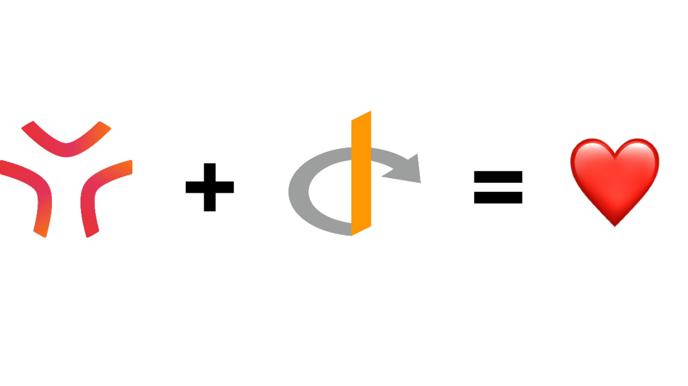
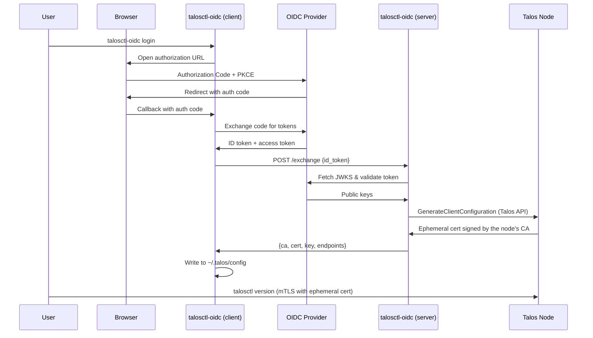
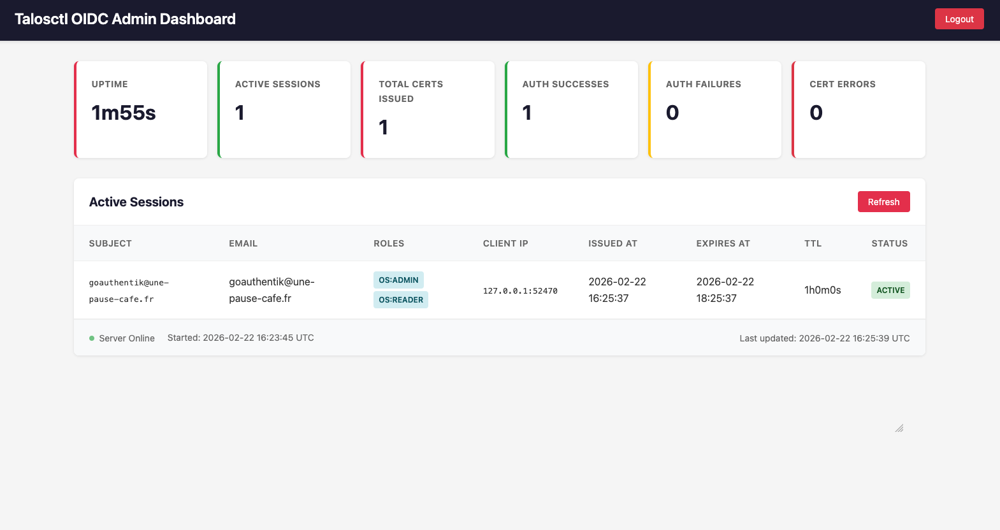

# talosctl-oidc

OIDC certificate exchange server and client for [Talos Linux](https://www.talos.dev/). Enables OIDC-based access control for `talosctl` by issuing ephemeral short-lived client certificates signed by the Talos CA.



## How It Works

Talos Linux uses **mTLS (mutual TLS) with client certificates** for API authentication. There is no native OIDC support in the Talos API. This tool bridges the gap through a **certificate exchange server** model:

1. A **server** (`talosctl-oidc serve`) runs alongside the cluster (on Kubernetes or standalone). It never holds the Talos CA private key. Instead it authenticates to the Talos API with its own client credential (a talosconfig)
2. A **user** runs `talosctl-oidc login`, which opens a browser for OIDC authentication (Authorization Code + PKCE)
3. The client sends the resulting ID token to the server
4. The server validates the token (signature, issuer, audience, expiry) and calls the Talos API method `GenerateClientConfiguration` (the same RPC `talosctl config new` uses) to mint an **ephemeral short-lived client certificate** (default: 5 minutes). The Talos node signs the certificate with the CA it already holds. The roles the server can grant are bounded by its own credential's roles (Talos rejects privilege escalation)
5. The client writes the certificate to `~/.talos/config` (using atomic updates to prevent corruption)
6. Before expiry, the client can proactively renew the certificate using the OIDC refresh token, either on demand or in the background via the `--watch` flag



## Demo


## Prerequisites

- **Go 1.25+** (to build from source)
- **A running Talos cluster** with API access
- **A Talos API client credential** (a talosconfig) for the server. On Kubernetes this is provisioned automatically via Talos API access; standalone, you generate one with `talosctl config new`
- **An OIDC provider** with a configured client application (any OIDC-compliant provider works)

## Installation

### curl (recommended)

The quickest way to install on Linux or macOS:

```bash
curl -fsSL https://raw.githubusercontent.com/qjoly/talosctl-oidc/main/install.sh | sh
```

The script:
- Detects your OS and architecture automatically
- Fetches the latest release from GitHub
- Verifies the SHA-256 checksum before installing
- Installs to `/usr/local/bin` (falls back to `~/.local/bin` if not writable)

**Install a specific version:**

```bash
curl -fsSL https://raw.githubusercontent.com/qjoly/talosctl-oidc/main/install.sh | VERSION=v0.0.2 sh
```

### Homebrew (macOS / Linux)

```bash
brew install qjoly/tap/talosctl-oidc
```

The formula is updated automatically on every release.

### Go install

If you have Go installed:

```bash
go install github.com/qjoly/talosctl-oidc@latest
```

### Manual download

Download the binary for your platform directly from the [releases page](https://github.com/qjoly/talosctl-oidc/releases/latest):

| OS | Architecture | Binary |
|----|-------------|--------|
| Linux | x86-64 | `talosctl-oidc-linux-amd64` |
| Linux | ARM64 | `talosctl-oidc-linux-arm64` |
| macOS | Intel | `talosctl-oidc-darwin-amd64` |
| macOS | Apple Silicon (M1/M2/M3) | `talosctl-oidc-darwin-arm64` |
| Windows | x86-64 | `talosctl-oidc-windows-amd64.exe` |

```bash
# Example: Linux amd64
curl -fsSL https://github.com/qjoly/talosctl-oidc/releases/latest/download/talosctl-oidc-linux-amd64 \
  -o /usr/local/bin/talosctl-oidc
chmod +x /usr/local/bin/talosctl-oidc
```

### From source

```bash
git clone https://github.com/qjoly/talosctl-oidc.git
cd talosctl-oidc
go build -o talosctl-oidc .
sudo mv talosctl-oidc /usr/local/bin/
```

## Setup

### 1. Configure your OIDC provider

Create a client application in your OIDC provider with the following settings:

| Setting | Value |
|---------|-------|
| Client type | Public |
| Grant type | Authorization Code |
| Redirect URI | `http://127.0.0.1:8900/callback` |
| Scopes | `openid`, `profile`, `email`, `offline_access` |
| PKCE | Enabled (S256) |

#### Authentik

1. Go to **Admin** > **Applications** > **Providers** > **Create**
2. Select **OAuth2/OpenID Provider**
3. Set **Client type** to **Public**
4. Set **Redirect URIs** to `http://127.0.0.1:8900/callback`
5. Under **Advanced**, ensure **Subject mode** is set appropriately
6. Add scopes `openid`, `profile`, `offline_access` and `email`
6. Create an **Application** linked to this provider

#### Keycloak

1. Go to your Keycloak admin console > **Clients** > **Create client**
2. Set **Client authentication** to **Off** (public client)
3. Enable **Standard flow** (Authorization Code)
4. Set **Valid redirect URIs** to `http://127.0.0.1:8900/callback`
5. Under **Advanced** > **Proof Key for Code Exchange**, set to `S256`

#### Dex

```yaml
staticClients:
  - id: talosctl
    name: "Talosctl OIDC"
    redirectURIs:
      - "http://127.0.0.1:8900/callback"
    public: true
```

### 2. Enable Talos API access

The server mints certificates by calling the Talos API, so it never needs the CA private key. Enable the `kubernetesTalosAPIAccess` feature on your control plane nodes and bound the roles and namespaces the API may grant.

Add this to your control plane machine config (then `talosctl apply-config`):

```yaml
machine:
  features:
    kubernetesTalosAPIAccess:
      enabled: true
      allowedRoles:
        - os:admin
      allowedKubernetesNamespaces:
        - talos-system   # the namespace the server runs in
```

> **Note**: `allowedRoles` bounds the roles the server's credential can hold. The server can never grant a role beyond this set, since Talos rejects privilege escalation.

For a standalone (non-Kubernetes) deployment, you instead generate a talosconfig credential with `talosctl config new` (see the [standalone section](#deploying-as-a-standalone-systemd-service)).

### 3. Start the server

The `serve` command can be configured via **environment variables** or a **YAML configuration file**. Environment variables take precedence over file values when both are set.

#### Option A: Configuration File (Recommended)

Create a `config.yaml` file and specify it with the `--config` flag:

```bash
talosctl-oidc serve --config config.yaml
```

**Example `config.yaml`:**

```yaml
issuer_url: https://idp.example.com/application/o/talos-oidc/
client_id: your-client-id
endpoints:
  - 10.0.0.1
  - 10.0.0.2
# Path to the talosconfig credential used to call the Talos API.
# Leave empty in-cluster to use the credential provisioned by the
# talos.dev ServiceAccount at /var/run/secrets/talos.dev/config.
talos_config: /etc/talosctl-oidc/talosconfig
listen: ":8443"
cert_ttl: "5m"

# Static roles — used when RBAC is disabled or no rule matches.
# Set to [] to deny access when no RBAC rule matches.
roles:
  - os:admin

# Optional: Rate limiting (disabled by default)
rate_limit_requests: 10
rate_limit_window: "1m"

# Optional: IP allowlist (empty = allow all)
ip_allowlist:
  - 192.168.1.0/24
  - 10.0.0.50

# Optional: Dynamic RBAC — map OIDC claims to Talos roles
# rbac:
#   rules:
#     - claim: groups
#       value: platform-admins
#       roles:
#         - os:admin
#     - claim: groups
#       value: developers
#       roles:
#         - os:reader
```

You can also set the config file path via the `TALOSCTL_OIDC_CONFIG` environment variable:

```bash
export TALOSCTL_OIDC_CONFIG=/etc/talosctl-oidc/config.yaml
talosctl-oidc serve
```

> **Note:** See the [Configuration wiki page](https://github.com/qjoly/talosctl-oidc/wiki/Configuration) for complete documentation on config file options and precedence rules.

#### Option B: Environment Variables

Configure entirely via environment variables:

```bash
export TALOSCTL_OIDC_TALOS_CONFIG=/etc/talosctl-oidc/talosconfig
export TALOSCTL_OIDC_ISSUER_URL=https://idp.example.com/application/o/talos-oidc/
export TALOSCTL_OIDC_CLIENT_ID=<your-client-id>
export TALOSCTL_OIDC_ENDPOINTS=10.0.0.1,10.0.0.2
export TALOSCTL_OIDC_LISTEN=:8443
export TALOSCTL_OIDC_CERT_TTL=5m
export TALOSCTL_OIDC_ROLES=os:admin

talosctl-oidc serve
```

By default, the server generates a **self-signed TLS certificate** at startup and logs the CA PEM. Save the CA PEM to a file and pass it to `login --server-ca` so the client trusts the server.

To use your own TLS certificates:

```bash
export TALOSCTL_OIDC_TLS_CERT=/path/to/server.crt
export TALOSCTL_OIDC_TLS_KEY=/path/to/server.key
talosctl-oidc serve
```

To run without TLS (not recommended for production):

```bash
export TALOSCTL_OIDC_INSECURE=true
talosctl-oidc serve
```

### 4. Login

```bash
# With self-signed TLS (default server mode), save the CA PEM from server logs:
talosctl-oidc login \
  --provider https://idp.example.com/application/o/talos-oidc/ \
  --client-id <your-client-id> \
  --server https://localhost:8443 \
  --server-ca server-ca.pem \
  --context-name oidc \
  --callback-port 8900

# With insecure server:
talosctl-oidc login \
  --provider https://idp.example.com/application/o/talos-oidc/ \
  --client-id <your-client-id> \
  --server http://localhost:8443 \
  --insecure \
  --context-name oidc \
  --callback-port 8900
```

By default the callback server only listens on `127.0.0.1`. When you log in from
a remote host, `--listen-address` lets you bind somewhere the browser can reach.
It can be repeated to serve both address families:

```bash
talosctl-oidc login \
  --provider https://idp.example.com/application/o/talos-oidc/ \
  --client-id <your-client-id> \
  --server https://localhost:8443 \
  --listen-address 10.10.10.10:8900 \
  --listen-address '[fd00::10]:8900'
```

The first `--listen-address` is the one sent as redirect URI, so it is the one
to register in your OIDC client.

Some providers (Kanidm, for instance) refuse plain-HTTP redirect URIs. Give the
callback server a certificate and key, and it serves HTTPS instead:

```bash
talosctl-oidc login \
  --provider https://idp.example.com/oauth2/openid/talos \
  --client-id <your-client-id> \
  --server https://localhost:8443 \
  --listen-address 127.0.0.1:8900 \
  --local-server-cert callback.crt \
  --local-server-key callback.key
```

The redirect URI then becomes `https://127.0.0.1:8900/callback`. The browser
must trust that certificate, so use one signed by a CA your system knows (mkcert
works well for local development).

If the URI registered in your OIDC client differs from the address you bind to —
TLS terminated by a reverse proxy, a hostname instead of an IP, another path —
`--oidc-redirect-url` sends that exact URI to the provider:

```bash
talosctl-oidc login \
  --provider https://idp.example.com/oauth2/openid/talos \
  --client-id <your-client-id> \
  --server https://localhost:8443 \
  --listen-address 0.0.0.0:8900 \
  --oidc-redirect-url https://talos.example.com/callback
```

The callback server also answers on the path of that URL, so a redirect URI
pointing at `/oidc/cb` works without extra setup.

On a host where no loopback callback is practical at all, `--device-code` uses
the OAuth device authorization grant (RFC 8628) instead: no browser, no local
listener, just a URL and a code to enter from another machine.

```bash
talosctl-oidc login \
  --provider https://idp.example.com/application/o/talos-oidc/ \
  --client-id <your-client-id> \
  --server https://localhost:8443 \
  --device-code
```

```
Open https://idp.example.com/device on any device and enter the code: WDJB-MJHT

Waiting for the login to be approved...
```

Your OIDC client must have the device flow enabled (in Keycloak, the
`oauth2DeviceAuthorizationGrantEnabled` toggle) and the provider must advertise
`device_authorization_endpoint` in its discovery document.

This will:

1. Open your browser to the OIDC provider login page
2. Wait for you to authenticate
3. Exchange the ID token with the cert server for an ephemeral certificate (over TLS)
4. Write the certificate to `~/.talos/config` under the `oidc` context
5. (Optional) If `--watch` is provided, stay in the foreground and refresh certificates as they approach expiry

### 5. Use talosctl

After login, `talosctl` works normally:

```bash
talosctl --context oidc version
talosctl --context oidc get members
talosctl --context oidc dashboard
```

## Commands

### `serve`

Start the certificate exchange server.

```bash
talosctl-oidc serve
```

#### Configuration

The server can be configured via **YAML configuration file** or **environment variables**:

- Use `--config <path>` flag or `TALOSCTL_OIDC_CONFIG` env var to specify a config file
- Environment variables override config file values
- See the [Configuration wiki page](https://github.com/qjoly/talosctl-oidc/wiki/Configuration) for details

#### Environment Variables

| Variable | Config File Field | Required | Default | Description |
|----------|-------------------|----------|---------|-------------|
| `TALOSCTL_OIDC_TALOS_CONFIG` | `talos_config` | No | | Path to the talosconfig credential used to call the Talos API. Empty in-cluster uses the credential provisioned at `/var/run/secrets/talos.dev/config` |
| `TALOSCTL_OIDC_ISSUER_URL` | `issuer_url` | Yes | | OIDC issuer URL for token validation |
| `TALOSCTL_OIDC_CLIENT_ID` | `client_id` | Yes | | Expected OIDC client ID / audience |
| `TALOSCTL_OIDC_ENDPOINTS` | `endpoints` | Yes | | Talos node endpoints (comma-separated) |
| `TALOSCTL_OIDC_CLIENT_SECRET` | `client_secret` | No | | OIDC client secret (for HS256-signed tokens) |
| `TALOSCTL_OIDC_LISTEN` | `listen` | No | `:8443` | Address to listen on |
| `TALOSCTL_OIDC_CERT_TTL` | `cert_ttl` | No | `5m` | Lifetime of issued client certificates |
| `TALOSCTL_OIDC_ROLES` | `roles` | No | `os:admin` | Talos roles (comma-separated) |
| `TALOSCTL_OIDC_TLS_CERT` | `tls_cert` | No | | Path to TLS certificate (HTTPS with provided cert) |
| `TALOSCTL_OIDC_TLS_KEY` | `tls_key` | No | | Path to TLS private key (must be set with TLS_CERT) |
| `TALOSCTL_OIDC_INSECURE` | `insecure` | No | `false` | Set to `true` to serve plain HTTP |
| `TALOSCTL_OIDC_DATA_DIR` | `data_dir` | No | | Directory to persist self-signed TLS certs across restarts |
| `TALOSCTL_OIDC_AUDIT_LOG` | `audit_log` | No | stdout | Path to audit log file (`-` for stdout) |
| `TALOSCTL_OIDC_ADMIN_TOKEN` | `admin_token` | No | | Bearer token to protect `/admin/*` endpoints (required to enable admin API) |
| `TALOSCTL_OIDC_RATE_LIMIT_REQUESTS` | `rate_limit_requests` | No | `0` | Max requests per IP per window (0 = disabled) |
| `TALOSCTL_OIDC_RATE_LIMIT_WINDOW` | `rate_limit_window` | No | `1m` | Rate limit time window (e.g., `1m`, `5m`, `1h`) |
| `TALOSCTL_OIDC_IP_ALLOWLIST` | `ip_allowlist` | No | | Comma-separated list of allowed IPs/CIDRs (empty = allow all) |
| `TALOSCTL_OIDC_TRUSTED_PROXIES` | `trusted_proxies` | No | | Comma-separated IPs/CIDRs of reverse proxies allowed to set `X-Forwarded-For` (empty = header never trusted) |
| `DEBUG` | — | No | | Set to any value to enable detailed debug logging (includes RBAC rule evaluation) |

#### TLS Modes

| Mode | Configuration | Description |
|------|--------------|-------------|
| **Self-signed** (default) | No TLS env vars | Generates a self-signed cert at startup, logs the CA PEM |
| **Self-signed + persisted** | `DATA_DIR=/data` | Same as above, but cert is saved to disk and reused on restart |
| **Provided cert** | `TLS_CERT` + `TLS_KEY` | HTTPS with your own certificate |
| **Insecure** | `INSECURE=true` | Plain HTTP (not recommended for production) |

When `TALOSCTL_OIDC_DATA_DIR` is set, the self-signed CA and server certificate are
saved to `<DATA_DIR>/ca.crt`, `ca.key`, `server.crt`, and `server.key`. On subsequent
restarts, the same certificates are reloaded so the CA PEM stays stable and clients
don't need to update their `--server-ca` file.

#### API Endpoints

| Endpoint | Method | Description |
|----------|--------|-------------|
| `/exchange` | POST | Exchange an OIDC ID token for an ephemeral certificate |
| `/healthz` | GET | Health check (returns `200 OK`) |
| `/ca` | GET | Returns the self-signed CA PEM (only in self-signed mode) |
| `/admin/` | GET | Web dashboard with session-based auth |
| `/admin/login` | POST | Login form submission |
| `/admin/logout` | POST | Logout and clear session |
| `/admin/stats` | GET | Server statistics (requires `Authorization: Bearer <admin-token>`) |
| `/admin/certs` | GET | List active (non-expired) issued certs (requires `Authorization: Bearer <admin-token>`) |

**Exchange request:**

```json
{"id_token": "eyJ..."}
```

**Exchange response:**

```json
{
  "ca": "-----BEGIN CERTIFICATE-----\n...",
  "cert": "-----BEGIN CERTIFICATE-----\n...",
  "key": "-----BEGIN ED25519 PRIVATE KEY-----\n...",
  "endpoints": ["10.0.0.1"],
  "ttl_seconds": 3600
}
```

### `login`

Authenticate via OIDC and obtain ephemeral Talos credentials.

```bash
talosctl-oidc login [flags]
```

| Flag | Required | Default | Description |
|------|----------|---------|-------------|
| `--provider` | Yes | | OIDC issuer URL |
| `--client-id` | Yes | | OIDC client ID |
| `--server` | Yes | | Cert exchange server URL (e.g. `https://localhost:8443`) |
| `--client-secret` | No | | OIDC client secret (for confidential clients) |
| `--scopes` | No | `openid,profile,email,offline_access` | OIDC scopes |
| `--callback-port` | No | `8900` | Local callback server port (shorthand for `--listen-address 127.0.0.1:PORT`) |
| `--listen-address` | No | `127.0.0.1:8900` | Address the callback server listens on, repeatable. Overrides `--callback-port`; the first one is used as redirect URI |
| `--oidc-redirect-url` | No | | Redirect URI advertised to the OIDC provider, when it differs from the listen address |
| `--local-server-cert` | No | | Path to a PEM certificate to serve the local callback over HTTPS (requires `--local-server-key`) |
| `--local-server-key` | No | | Path to the PEM private key matching `--local-server-cert` |
| `--context-name` | No | `oidc` | Name for the talosconfig context |
| `--talosconfig` | No | `~/.talos/config` | Path to talosconfig file |
| `--server-ca` | No | | Path to PEM CA certificate to trust for the server (for self-signed TLS) |
| `--insecure` | No | `false` | Allow plain HTTP connection to the server |
| `--watch` | No | `false` | Run in the background and keep the Talos certificate fresh |
| `--skip-open-browser` | No | `false` | Only print the authorization URL instead of opening a browser |
| `--browser-command` | No | | Command used to open the authorization URL, instead of the platform default |
| `--device-code` | No | `false` | Use the OAuth device authorization grant (RFC 8628) instead of the browser callback |

### `logout`

Remove OIDC credentials and clear cached tokens.

```bash
talosctl-oidc logout [flags]
```

| Flag | Required | Default | Description |
|------|----------|---------|-------------|
| `--context-name` | No | `oidc` | Name of the talosconfig context to remove |
| `--talosconfig` | No | `~/.talos/config` | Path to talosconfig file |

This removes:

- The OIDC token from the system keychain
- The context (including embedded certificates) from the talosconfig file

### `status`

Display current authentication status.

```bash
talosctl-oidc status [flags]
```

| Flag | Required | Default | Description |
|------|----------|---------|-------------|
| `--context-name` | No | `oidc` | Name of the talosconfig context to check |
| `--talosconfig` | No | `~/.talos/config` | Path to talosconfig file |

## Deployment Methods

Choose the deployment method that best fits your infrastructure:

| Method | Best for | Complexity | Notes |
|---|---|---|---|
| [Kubernetes Deployment](#deploying-on-kubernetes) | Multi-cluster, existing k8s platform | Medium | Needs external access from developer workstations |
| [Standalone systemd](#deploying-as-a-standalone-systemd-service) | Air-gapped, dedicated infra, simplicity | Low | Manual updates, needs a Linux host |

---

## Deploying on Kubernetes

This method runs the server as a Kubernetes `Deployment` managed by a Helm chart. It is a good fit if you already have a Kubernetes cluster and want to share the server across multiple Talos clusters or teams.

**Requirements**: the server endpoint must be reachable from developer workstations, not just from inside the cluster. See [Exposing the server](#4-expose-the-server) below.

### 1. Add the Helm chart

The chart is published to GHCR as an OCI chart. Install the latest release directly:

```bash
helm install talosctl-oidc \
  oci://ghcr.io/qjoly/charts/talosctl-oidc \
  --version <version> \
  --namespace talos-system --create-namespace
```

Alternatively, clone the repository and install from the local path:

```bash
git clone https://github.com/qjoly/talosctl-oidc.git
cd talosctl-oidc
helm install talosctl-oidc charts/talosctl-oidc/ --namespace talos-system --create-namespace
```

> The Helm chart deploys the **server image** (`ghcr.io/qjoly/talosctl-oidc-server`), which includes the system CA bundle at the standard `/etc/ssl/certs/ca-certificates.crt` path and the binary at `/talosctl-oidc`.

### 2. Enable Talos API access

The server issues certificates by calling the Talos API (`GenerateClientConfiguration`), so it **never holds the cluster CA private key**. The Talos node signs each certificate, and the roles the server can grant are bounded by its own credential (Talos rejects privilege escalation).

#### Prerequisite: enable the feature on the nodes

In the Talos machine config of the control plane nodes:

```yaml
machine:
  features:
    kubernetesTalosAPIAccess:
      enabled: true
      allowedRoles:
        - os:admin
      allowedKubernetesNamespaces:
        - talos-system   # the release namespace
```

#### Option A: Chart-managed credential (default)

With `talos.apiAccess.enabled=true`, the chart creates a `serviceaccounts.talos.dev` resource. Talos provisions a short-lived talosconfig into a secret that the pod mounts, so no manual secret handling is needed.

```bash
helm install talosctl-oidc charts/talosctl-oidc/ \
  --namespace talos-system --create-namespace \
  --set talos.apiAccess.enabled=true \
  --set "talos.apiAccess.roles={os:admin}" \
  --set config.issuerUrl=https://idp.example.com/application/o/talos-oidc/ \
  --set config.clientId=your-client-id \
  --set "config.endpoints={10.0.0.1,10.0.0.2}"
```

#### Option B: Existing credential secret

Provide a secret that already contains a talosconfig under the `config` key (e.g. one generated with `talosctl config new`), then point the chart at it:

```bash
helm install talosctl-oidc charts/talosctl-oidc/ \
  --namespace talos-system --create-namespace \
  --set talos.existingCredentialSecret=my-talosconfig \
  --set config.issuerUrl=https://idp.example.com/application/o/talos-oidc/ \
  --set config.clientId=your-client-id \
  --set "config.endpoints={10.0.0.1,10.0.0.2}"
```

### 3. Key chart values

| Value | Default | Description |
|---|---|---|
| `config.issuerUrl` | `""` | OIDC issuer URL (required) |
| `config.clientId` | `""` | OIDC client ID (required) |
| `config.clientSecret` | `""` | OIDC client secret (optional) |
| `config.endpoints` | `[]` | Talos node endpoints (required) |
| `config.roles` | `[os:admin]` | Talos roles for issued certs |
| `config.certTTL` | `5m` | Lifetime of issued client certificates |
| `config.adminToken` | `""` | Bearer token to enable the admin API |
| `config.auditLog` | `-` | Audit log destination (`-` for stdout) |
| `talos.apiAccess.enabled` | `true` | Create a `serviceaccounts.talos.dev` resource so Talos provisions the API credential |
| `talos.apiAccess.roles` | `[os:admin]` | Roles for the server's own credential (bounds the certs it can issue) |
| `talos.configMountPath` | `/var/run/secrets/talos.dev` | Mount path for the provisioned talosconfig |
| `talos.existingCredentialSecret` | `""` | Use an existing talosconfig secret (`config` key) instead of creating the resource |
| `service.type` | `ClusterIP` | Kubernetes Service type |
| `ingress.enabled` | `false` | Enable Ingress |
| `tolerations` | `[]` | Pod tolerations |
| `extraVolumes` | `[]` | Additional volumes to attach to the pod |
| `extraVolumeMounts` | `[]` | Additional volume mounts for the container |

To persist the self-signed TLS certificate across pod restarts (so the CA PEM stays stable), mount a PersistentVolumeClaim and set `TALOSCTL_OIDC_DATA_DIR` via `extraVolumes` / `extraVolumeMounts`:

```bash
helm upgrade talosctl-oidc charts/talosctl-oidc/ \
  --namespace talos-system \
  --set "extraVolumes[0].name=tls-data" \
  --set "extraVolumes[0].persistentVolumeClaim.claimName=talosctl-oidc-tls" \
  --set "extraVolumeMounts[0].name=tls-data" \
  --set "extraVolumeMounts[0].mountPath=/data" \
  --set "extraEnv[0].name=TALOSCTL_OIDC_DATA_DIR" \
  --set "extraEnv[0].value=/data"
```

### 4. Expose the server

The server handles its own TLS — the client verifies the server CA directly. **Standard TLS-terminating ingresses will break the connection.** Choose one of the options below.

#### Option A — LoadBalancer Service (simplest)

```bash
helm upgrade talosctl-oidc charts/talosctl-oidc/ \
  --namespace talos-system \
  --set service.type=LoadBalancer
```

```bash
kubectl get svc talosctl-oidc -n talos-system
# NAME             TYPE           CLUSTER-IP     EXTERNAL-IP    PORT(S)          AGE
# talosctl-oidc    LoadBalancer   10.96.12.34    203.0.113.10   8443:32443/TCP   1m
```

Users connect to `https://203.0.113.10:8443`.

#### Option B — NodePort Service

```bash
helm upgrade talosctl-oidc charts/talosctl-oidc/ \
  --namespace talos-system \
  --set service.type=NodePort
```

Users connect to `https://<any-node-ip>:<node-port>`.

#### Option C — Ingress

If you want to expose the server on a custom domain (e.g. `https://oidc.example.com`), you can use an ingress. Be careful that you should enable insecure mode and let the ingress handle TLS termination (which means the connection between the ingress and the server is unencrypted, but the client-server connection is still secure with TLS).

```bash
helm upgrade talosctl-oidc charts/talosctl-oidc/ \
  --namespace talos-system \
  --set ingress.enabled=true \
  --set ingress.className=traefik \
  --set "ingress.hosts[0].host=oidc.example.com" \
  --set "ingress.hosts[0].paths[0].path=/" \
  --set "ingress.hosts[0].paths[0].pathType=Prefix"
```

This could not be the most secure option since the traffic between the ingress and the server is unencrypted.

Another option could be to generate a TLS Certificate through cert-manager and map it to the server through a Kubernetes Secret (to configure SSL passthrough). This way, the connection between the ingress and the server is also encrypted, but it requires more setup (see issue)

### 5. Retrieve the server CA and log in

If you used the self-signed TLS mode, the CA PEM is stable across restarts if you set `TALOSCTL_OIDC_DATA_DIR`. You can retrieve it from the server's `/ca` endpoint:

```bash
# Fetch the self-signed CA from the /ca endpoint
curl -k https://<external-ip>:8443/ca > server-ca.pem

# Log in
talosctl-oidc login \
  --provider https://idp.example.com/application/o/talos-oidc/ \
  --client-id your-client-id \
  --server https://<external-ip>:8443 \
  --server-ca server-ca.pem \
  --context-name oidc
```

This is not needed if you used your own TLS certificates.

---

## Deploying as a Standalone systemd Service

This method runs the server directly on a Linux host (a jump host, a VM, or any machine that developer workstations can reach). No Kubernetes or Talos node is required.

### 1. Install the binary

**From GitHub releases** (replace the version as needed):

```bash
curl -L https://github.com/qjoly/talosctl-oidc/releases/latest/download/talosctl-oidc-linux-amd64 \
  -o /usr/local/bin/talosctl-oidc
chmod +x /usr/local/bin/talosctl-oidc
```

**From source**:

```bash
git clone https://github.com/qjoly/talosctl-oidc.git
cd talosctl-oidc
go build -o /usr/local/bin/talosctl-oidc .
```

### 2. Create a dedicated user and directories

```bash
useradd --system --no-create-home --shell /sbin/nologin talosctl-oidc

mkdir -p /etc/talosctl-oidc /var/lib/talosctl-oidc /var/log/talosctl-oidc
chown talosctl-oidc:talosctl-oidc /var/lib/talosctl-oidc /var/log/talosctl-oidc
chmod 750 /var/lib/talosctl-oidc
```

### 3. Provide a Talos API credential

The server authenticates to the Talos API with a talosconfig credential. From an admin machine that already has cluster access, generate a short-lived credential scoped to the roles the server should be able to grant:

```bash
# Generate a talosconfig for the server (adjust roles and TTL as needed)
talosctl config new --roles os:admin --crt-ttl 8760h /tmp/server-talosconfig

# Copy it to the server host
cp /tmp/server-talosconfig /etc/talosctl-oidc/talosconfig
chown talosctl-oidc:talosctl-oidc /etc/talosctl-oidc/talosconfig
chmod 400 /etc/talosctl-oidc/talosconfig
```

> The roles in this credential bound what the server can issue. Talos rejects any request for roles beyond them.

### 4. Create the environment file

```bash
cat > /etc/talosctl-oidc/env << 'EOF'
TALOSCTL_OIDC_TALOS_CONFIG=/etc/talosctl-oidc/talosconfig
TALOSCTL_OIDC_ISSUER_URL=https://idp.example.com/application/o/talos-oidc/
TALOSCTL_OIDC_CLIENT_ID=your-client-id
TALOSCTL_OIDC_ENDPOINTS=10.0.0.1,10.0.0.2
TALOSCTL_OIDC_CERT_TTL=5m
TALOSCTL_OIDC_ROLES=os:admin
TALOSCTL_OIDC_DATA_DIR=/var/lib/talosctl-oidc
TALOSCTL_OIDC_AUDIT_LOG=/var/log/talosctl-oidc/audit.log
EOF

chmod 600 /etc/talosctl-oidc/env
chown talosctl-oidc:talosctl-oidc /etc/talosctl-oidc/env
```

> The env file contains the talosconfig path and OIDC client settings. Restrict access with `chmod 600`.

### 5. Create the systemd unit

```bash
cat > /etc/systemd/system/talosctl-oidc.service << 'EOF'
[Unit]
Description=talosctl-oidc certificate exchange server
Documentation=https://github.com/qjoly/talosctl-oidc
After=network-online.target
Wants=network-online.target

[Service]
Type=simple
User=talosctl-oidc
Group=talosctl-oidc
EnvironmentFile=/etc/talosctl-oidc/env
ExecStart=/usr/local/bin/talosctl-oidc serve
Restart=on-failure
RestartSec=5s

# Hardening
NoNewPrivileges=true
PrivateTmp=true
ProtectSystem=strict
ProtectHome=true
ReadWritePaths=/var/lib/talosctl-oidc /var/log/talosctl-oidc

[Install]
WantedBy=multi-user.target
EOF
```

### 6. Enable and start the service

```bash
systemctl daemon-reload
systemctl enable --now talosctl-oidc

# Check status
systemctl status talosctl-oidc

# View logs
journalctl -u talosctl-oidc -f
```

### 7. Open the firewall

Allow TCP port 8443 from developer workstations only. Example with `ufw`:

```bash
ufw allow from <developer-subnet> to any port 8443 proto tcp
```

Or with `firewalld`:

```bash
firewall-cmd --add-rich-rule='rule family="ipv4" source address="<developer-subnet>" port port="8443" protocol="tcp" accept' --permanent
firewall-cmd --reload
```

### 8. Retrieve the server CA and log in

The CA PEM is stable across restarts when `TALOSCTL_OIDC_DATA_DIR` is set:

```bash
curl -k https://<host-ip>:8443/ca > server-ca.pem

talosctl-oidc login \
  --provider https://idp.example.com/application/o/talos-oidc/ \
  --client-id your-client-id \
  --server https://<host-ip>:8443 \
  --server-ca server-ca.pem \
  --context-name oidc
```

---

## Token Caching Behavior

OIDC tokens are cached in the **system keychain** (macOS Keychain, GNOME Keyring, KDE Wallet, or Windows Credential Manager).

| Scenario | Behavior |
|----------|----------|
| No cached token | Opens browser for full OIDC login |
| Valid cached token | Skips browser, exchanges cached token for new cert |
| Expired token with refresh token | Silently refreshes, no browser needed |
| Expired token without refresh token | Opens browser for full OIDC login |
| Refresh fails | Falls back to full OIDC login |
| Certificate about to expire | Proactively renews using refresh token if `--watch` or rerun `login` |

The login flow has a **5-minute timeout**. If the user does not complete authentication in the browser within that window, the command exits with an error.

## Multiple Clusters

Use `--context-name` to manage credentials for different Talos clusters:

```bash
# Login to production cluster
talosctl-oidc login \
  --provider https://idp.example.com/realms/talos \
  --client-id talosctl \
  --server https://prod-oidc-server:8443 \
  --server-ca prod-ca.pem \
  --context-name prod

# Login to staging cluster
talosctl-oidc login \
  --provider https://idp.example.com/realms/talos \
  --client-id talosctl \
  --server https://staging-oidc-server:8443 \
  --server-ca staging-ca.pem \
  --context-name staging

# Switch between clusters
talosctl --context prod version
talosctl --context staging version

# Check status of each
talosctl-oidc status --context-name prod
talosctl-oidc status --context-name staging
```

## Audit Logging

The server emits structured JSON audit events for every authentication attempt and certificate issuance. Each event is a single JSON line written to the configured output.

### Configuration

By default, audit events are written to **stdout** (mixed with regular log output). To write to a dedicated file:

```bash
export TALOSCTL_OIDC_AUDIT_LOG=/var/log/talosctl-oidc/audit.log
```

### Event Types

| Event | Description |
|-------|-------------|
| `auth_success` | OIDC token validated successfully |
| `auth_failure` | Token validation failed (invalid signature, expired, wrong audience, etc.) |
| `cert_issued` | Ephemeral client certificate issued to authenticated user |
| `cert_error` | Certificate generation failed after successful authentication |

### Example Events

```json
{"timestamp":"2026-02-17T14:30:00Z","type":"cert_issued","subject":"abc123","email":"user@example.com","issuer":"https://idp.example.com/","client_ip":"192.168.1.10:52431","roles":["os:admin"],"cert_ttl":"5m0s","cert_expiry":"2026-02-17T14:35:00Z"}
{"timestamp":"2026-02-17T14:31:00Z","type":"auth_failure","client_ip":"10.0.0.5:48291","error":"token expired"}
```

### Fields

| Field | Description |
|-------|-------------|
| `timestamp` | UTC timestamp of the event |
| `type` | Event type (`auth_success`, `auth_failure`, `cert_issued`, `cert_error`) |
| `subject` | OIDC subject identifier (`sub` claim) |
| `email` | User's email from the OIDC token |
| `issuer` | OIDC issuer URL |
| `client_ip` | Remote address of the client |
| `roles` | Talos roles assigned to the issued certificate |
| `cert_ttl` | Lifetime of the issued certificate |
| `cert_expiry` | When the issued certificate expires |
| `error` | Error message (for failure events) |

## Admin API

The server provides optional admin endpoints for monitoring server activity and inspecting active certificates. These endpoints are protected by a bearer token.

### Enabling the Admin API

Set the `TALOSCTL_OIDC_ADMIN_TOKEN` environment variable to a secret value:

```bash
export TALOSCTL_OIDC_ADMIN_TOKEN=$(openssl rand -hex 32)
```

If this variable is not set, the admin endpoints return `403 Forbidden`.

### Endpoints

#### `GET /admin/stats`

Returns aggregate server statistics.

```bash
curl -s -H "Authorization: Bearer $TALOSCTL_OIDC_ADMIN_TOKEN" \
  https://localhost:8443/admin/stats | jq .
```

```json
{
  "started_at": "2026-02-17T14:00:00Z",
  "uptime": "2h30m0s",
  "total_certs_issued": 42,
  "active_certs": 5,
  "total_auth_successes": 45,
  "total_auth_failures": 3,
  "total_cert_errors": 0
}
```

#### `GET /admin/certs`

Returns the list of currently active (non-expired) issued certificates.

```bash
curl -s -H "Authorization: Bearer $TALOSCTL_OIDC_ADMIN_TOKEN" \
  https://localhost:8443/admin/certs | jq .
```

```json
[
  {
    "subject": "abc123",
    "email": "user@example.com",
    "issued_at": "2026-02-17T15:30:00Z",
    "expires_at": "2026-02-17T16:30:00Z",
    "client_ip": "192.168.1.10:52431",
    "roles": ["os:admin"],
    "ttl": "1h0m0s"
  }
]
```

Expired certificates are automatically pruned from the list on each request.

### Web Dashboard

The server provides a web-based admin dashboard for visual monitoring. Navigate to `/admin/` in your browser:



```
https://localhost:8443/admin/
```

The dashboard provides:
- **Login page** with token-based authentication
- **Real-time statistics** showing uptime, active sessions, auth successes/failures
- **Active sessions table** with user details, roles, and certificate expiry
- **Auto-refresh** capability and logout functionality

Sessions are maintained via HTTP-only cookies with a 24-hour timeout.

**Example:**

1. Open `https://localhost:8443/admin/` in your browser
2. Enter your admin token when prompted
3. View the dashboard with all statistics and active sessions

The API endpoints (`/admin/stats` and `/admin/certs`) continue to accept Bearer tokens for programmatic access.

## Rate Limiting and IP Allowlist

The server supports optional rate limiting and IP allowlisting on the `/exchange` endpoint to protect against abuse and brute-force attacks.

### Rate Limiting

Rate limiting is **disabled by default**. When enabled, it applies a per-IP sliding window limit to the `/exchange` endpoint.

| Setting | Description | Default |
|---------|-------------|---------|
| `rate_limit_requests` | Maximum requests allowed per IP per window | `0` (disabled) |
| `rate_limit_window` | Time window for counting requests | `1m` |

**Configuration via environment variables:**
```bash
export TALOSCTL_OIDC_RATE_LIMIT_REQUESTS=10
export TALOSCTL_OIDC_RATE_LIMIT_WINDOW=1m
```

**Configuration via config file:**
```yaml
rate_limit_requests: 10
rate_limit_window: "1m"
```

**Example:** Allow 10 requests per minute per IP. Additional requests receive `429 Too Many Requests` with a `Retry-After` header.

> **Per-IP key behind a proxy:** the rate-limit bucket is keyed on the connection address by default. `X-Forwarded-For` is only used when the request's direct peer is listed in `trusted_proxies` — otherwise a client could rotate the header to mint a fresh bucket on every request, bypassing the limit. Set `trusted_proxies` (env `TALOSCTL_OIDC_TRUSTED_PROXIES`) to your ingress/proxy network.

### IP Allowlist

IP allowlisting restricts access to the `/exchange` endpoint to specific IP addresses or CIDR ranges.

| Setting | Description | Default |
|---------|-------------|---------|
| `ip_allowlist` | List of allowed IPs or CIDR ranges | (empty = allow all) |

**Configuration via environment variables:**
```bash
export TALOSCTL_OIDC_IP_ALLOWLIST="192.168.1.0/24,10.0.0.50,172.16.0.0/16"
```

**Configuration via config file:**
```yaml
ip_allowlist:
  - 192.168.1.0/24
  - 10.0.0.50
  - 172.16.0.0/16
```

**Note:** Requests from IPs not in the allowlist receive `403 Forbidden`.

> **Running behind a reverse proxy?** The `X-Forwarded-For` header is only honored when the request's direct peer is listed in `trusted_proxies` (see below). Otherwise the header is attacker-controlled and is ignored in favor of the real connection address — without this, anyone could forge `X-Forwarded-For` to bypass the allowlist.

```bash
export TALOSCTL_OIDC_TRUSTED_PROXIES="10.0.0.0/8,192.168.0.1"
```

```yaml
trusted_proxies:
  - 10.0.0.0/8
  - 192.168.0.1
```

### Helm Chart Configuration

```yaml
config:
  rateLimitRequests: 10
  rateLimitWindow: "1m"
  ipAllowlist:
    - 192.168.1.0/24
    - 10.0.0.50
```

## Role-Based Access Control (RBAC)

By default, every authenticated user receives the same static set of roles configured in `roles`. RBAC lets you map OIDC token claims (such as group membership) to different Talos roles dynamically, so users get only the permissions they need.

### How It Works

When RBAC rules are configured, the server evaluates each rule against the claims in the validated ID token. Rules are checked in order; **all** matching rules' roles are combined (union). If no rule matches, the user receives the static `roles` list as a fallback.

If `roles` is empty **and** RBAC is enabled but no rules match, the exchange request is rejected with `403 Forbidden` — enforcing least-privilege by default.

### Configuration

Add an `rbac` block to your `config.yaml`:

```yaml
# Fallback roles when no RBAC rule matches.
# Set to [] to deny access when no rule matches.
roles: []

rbac:
  rules:
    # Users in the 'platform-admins' OIDC group get full admin access.
    - claim: groups
      value: platform-admins
      roles:
        - os:admin

    # Users in the 'developers' group get read-only access.
    - claim: groups
      value: developers
      roles:
        - os:reader

    # A separate claim can also be used (e.g., a custom 'department' claim).
    - claim: department
      value: sre
      roles:
        - os:admin
```

### Supported Claim Types

The RBAC engine handles multiple ways OIDC providers encode claim values:

| Claim format | Example | Behaviour |
|---|---|---|
| String | `"platform-admins"` | Exact match |
| Space-separated string | `"group1 group2"` | Splits on whitespace and checks each token |
| JSON array of strings | `["platform-admins","developers"]` | Checks each element |

### RBAC Rules Reference

Each rule under `rbac.rules` has three fields:

| Field | Required | Description |
|---|---|---|
| `claim` | Yes | The OIDC claim name to inspect (e.g. `groups`, `roles`, `email`) |
| `value` | Yes | The expected value that must appear in the claim |
| `roles` | Yes | Talos roles to grant when this rule matches |

### Available Talos Roles

| Role | Description |
|---|---|
| `os:admin` | Full administrative access to all Talos API operations |
| `os:reader` | Read-only access (inspect nodes, services, config) |
| `os:etcd:backup` | Permission to trigger etcd backups |

### Interaction with Static `roles`

| RBAC configured | Rule matched | Result |
|---|---|---|
| No | — | Static `roles` applied to all users |
| Yes | Yes | Matched rules' roles applied (static `roles` ignored) |
| Yes | No | Static `roles` applied as fallback |
| Yes | No | **403 Forbidden** if `roles: []` is also empty |

### Debugging RBAC

Set `DEBUG=1` on the server to see per-rule evaluation in the logs:

```
[DEBUG] [RBAC] Evaluating 3 RBAC rules against claims
[DEBUG] [RBAC] Rule 1: checking claim 'groups' = '[platform-admins developers]' against expected value 'platform-admins'
[DEBUG] [RBAC]   -> checking []interface{} with 2 items
[DEBUG] [RBAC]     item 0: platform-admins
[DEBUG] [RBAC]     -> MATCH at index 0
[DEBUG] [RBAC] Rule 1: MATCH! Assigning roles: [os:admin]
[DEBUG] [RBAC] RBAC evaluation complete. Assigned roles: [os:admin]
```

### Provider-specific Notes

#### Authentik

Authentik sends group membership as a JSON array of strings in the `groups` claim. The group name is the full display name configured in Authentik (e.g. `"authentik Admins"` — note the space is part of the name, not a separator):

```yaml
rbac:
  rules:
    - claim: groups
      value: "authentik Admins"
      roles:
        - os:admin
```

#### Keycloak

Keycloak can send roles as an array in `roles` or as realm/client roles nested under `realm_access.roles`. Use the top-level `roles` claim if you configure it as a mapper, or use a custom claim name:

```yaml
rbac:
  rules:
    - claim: roles
      value: talos-admin
      roles:
        - os:admin
```

#### Dex

Dex passes group membership from upstream connectors in the `groups` claim as a string array. Configuration is the same as the standard example above.

> **Note:** See the [RBAC wiki page](https://github.com/qjoly/talosctl-oidc/wiki/RBAC) for more detailed examples and troubleshooting.

---

## Security Considerations

- **TLS by default**: The server generates a self-signed TLS certificate at startup when no TLS configuration is provided. Plain HTTP requires explicitly setting `TALOSCTL_OIDC_INSECURE=true`
- **Ephemeral certificates**: Client certificates are short-lived (default 5 minutes). Users cannot extend or forge certificates without re-authenticating
- **CA key isolation**: The Talos CA private key is never held by this server. Certificates are minted by the Talos node via the Talos API, so the CA key never leaves the nodes that already hold it
- **PKCE is mandatory**: The OIDC flow uses S256 challenge method, protecting against authorization code interception
- **OIDC tokens are stored in the system keychain**, encrypted at rest by the operating system
- **Token validation**: The server validates ID tokens against the OIDC provider's JWKS (RS256, ES256, EdDSA) or HMAC secret (HS256)
- **The callback server binds to `127.0.0.1` only**, preventing access from other machines
- **State parameter** is used for CSRF protection during the OIDC flow
- **Admin API is opt-in**: The `/admin/*` endpoints are disabled by default and require setting `TALOSCTL_OIDC_ADMIN_TOKEN`. The token is compared using constant-time comparison to prevent timing attacks
- **Audit logging** provides a tamper-evident record of all authentication events for compliance and security monitoring
- **Rate limiting** can be configured to prevent brute-force attacks on the `/exchange` endpoint (disabled by default)
- **IP allowlisting** can restrict access to specific networks or IP addresses (disabled by default)

### Certificate Revocation Strategy (ISO 27001 A.9.2.6)

Talos does not support CRL (Certificate Revocation List) or OCSP checks on client certificates. This means a compromised certificate cannot be invalidated before it expires. This is addressed through the following layered compensating controls:

| Control | Mechanism | Effect |
|---|---|---|
| **Short certificate TTL** | Set `cert_ttl` to 5–10 minutes (default: `5m`) | A compromised certificate becomes invalid within minutes without any action |
| **Auto-renewal via `--watch`** | Client renews automatically before expiry using the cached refresh token | Short TTLs are transparent to the user |
| **IdP refresh token revocation** | Revoke the user's refresh token in your OIDC provider | Prevents the client from obtaining a new certificate after the current one expires |

**Recommended response to a compromised credential:**

1. Immediately revoke the user's **refresh token** (and/or session) in your OIDC provider. This stops the `--watch` loop and any subsequent `login` from successfully renewing the certificate.
2. The existing certificate remains usable for at most the configured `cert_ttl` (default 5 minutes).
3. Optionally, lower `cert_ttl` to `1m` or less in your server configuration for higher-sensitivity environments. Note that this increases the frequency of cert-exchange requests.

**How to revoke in common IdPs:**

- **Authentik**: Admin → Directory → Users → select user → Sessions → Revoke all, or revoke the specific token under Tokens
- **Keycloak**: Admin Console → Users → select user → Sessions → Log Out, or use the Token Introspection / Revocation API
- **Dex**: Revoke through the upstream connector (Dex itself has no revocation endpoint)

This strategy is documented as a compensating control for ISO 27001 A.9.2.6 (removal or adjustment of access rights). The combination of a short TTL and IdP revocation provides an effective access removal window bounded by the certificate TTL.

## Debugging

You can enable detailed internal tracing for both the client and the server by setting the `DEBUG` environment variable to any non-empty value.

```bash
# Debug client-side login flow
DEBUG=1 talosctl-oidc login --provider ...

# Debug server-side exchange flow
DEBUG=1 talosctl-oidc serve
```

Debug logs include information about OIDC discovery, PKCE challenges, token response fields, keychain/file storage operations, and certificate expiry calculations.

### Local test environment

`./test.sh` starts Dex (in Docker or Podman) and the exchange server so you can run `talosctl-oidc login` by hand against a real Talos cluster. Set `TALOSCONFIG` to a valid credential first.

The non-interactive counterpart runs in CI (`.tangled/workflows/integration.yml`): it replays the whole OIDC flow against a mock Talos API, without the CLI.

## Troubleshooting

### "invalid_client" error during login

The OIDC provider is rejecting the token request. Common causes:

- The provider is configured as a **confidential client** but no `--client-secret` was provided. Either switch to a public client or pass `--client-secret`
- The **Client ID** is incorrect

### "failed to open browser: exec: \"xdg-open\": executable file not found in $PATH"

This is now only a warning: the authorization URL has already been printed and
the callback server is listening, so the login carries on. Use
`--skip-open-browser` to silence the attempt entirely, or `--browser-command` to
name the binary to run. The callback still has to be reachable from wherever you
open the URL, so pair it with an SSH port forward or with `--listen-address` —
or use `--device-code`, which needs no local listener at all.

### "failed to listen on 127.0.0.1:8900"

Another process is using port 8900. Use `--callback-port` to pick a different port. Make sure the redirect URI in your OIDC provider matches (e.g. `http://127.0.0.1:9000/callback`).

### "OIDC discovery failed"

The tool could not reach the OIDC provider's `/.well-known/openid-configuration` endpoint. Verify:

- The `--provider` / `--issuer-url` is correct and reachable
- Your network/proxy allows access to the provider

### "state mismatch: possible CSRF attack"

The state parameter returned by the OIDC provider does not match what was sent. This could indicate a stale browser tab. Try the login again.

### Server: "Talos API" error

The server could not call the Talos API to issue a certificate. Verify:

- `TALOSCTL_OIDC_TALOS_CONFIG` points at a valid talosconfig, or the in-cluster credential is mounted at `/var/run/secrets/talos.dev/config`
- The Talos nodes have `machine.features.kubernetesTalosAPIAccess` enabled, with the server's namespace in `allowedKubernetesNamespaces`
- The roles the server requests are within the credential's `allowedRoles` (Talos rejects privilege escalation)
- The configured `endpoints` are reachable from the server

### Keychain errors on Linux

On Linux, `go-keyring` requires a running secret service (GNOME Keyring or KDE Wallet). On headless servers:

```bash
sudo apt install gnome-keyring
eval $(gnome-keyring-daemon --start --components=secrets)
export GNOME_KEYRING_CONTROL
```
